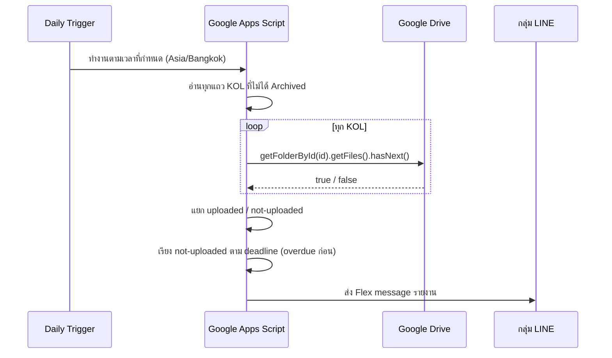

ARKA ส่งสินค้าให้ KOL โปรโมตใน Instagram พอมี KOL หลายคนพร้อมกัน ก็ไม่มีทางรู้ว่าใครถ่ายและอัปโหลดรูปแล้ว กับใครที่รับสินค้าไปแล้วเงียบหายไป ระบบ Google Sheets พร้อม Drive folder automation และรายงาน LINE รายวันช่วยปิดช่องโหว่นั้น

## เกี่ยวกับโปรแกรม KOL ของ ARKA

ARKA ร่วมงานกับ KOL เพื่อโปรโมตคอลเลกชันใหม่ใน Instagram และ TikTok แต่ละ KOL จะได้รับสินค้า ถ่ายภาพในสไตล์ของตัวเอง และอัปโหลดไฟล์ไปยัง Google Drive folder ที่สร้างไว้ให้ ARKA ไม่ได้ตรวจคอนเทนต์ก่อนโพสต์ — Drive folder คือตัวบ่งชี้ว่างานเกิดขึ้นแล้ว

## ปัญหา

ก่อนมีระบบนี้ การติดตาม KOL ที่ active อยู่พึ่งความจำเป็นหลัก ส่งสินค้าไปแล้วลืม กว่าจะรู้ก็ผ่านไปหลายอาทิตย์แล้วว่า KOL ไม่ได้อัปโหลดอะไรเลย ไม่มีบันทึกกลางว่าใครได้รับสินค้าอะไร deadline คือวันไหน หรืออัปโหลดอะไรไปบ้างแล้ว

## ชีต KOL Tracking

ระบบนี้เป็น Google Sheets bound script แต่ละแถวคือแคมเปญ KOL หนึ่งคน ประกอบด้วย:

- Instagram URL และจำนวน Followers
- ชื่อ เบอร์โทร ที่อยู่ สัดส่วนร่างกาย
- สินค้าที่ส่ง และวันที่จัดส่ง
- Deadline การโพสต์
- หมายเลขพัสดุ
- Email (สำหรับสิทธิ์เข้า Drive)
- URL ของ Drive folder
- Favorite และ Archived

## สร้าง Drive Folder

เลือกแถว KOL ที่ต้องการ แล้วกด **ARKA Tools → Create Drive Folder** สคริปต์จะ:

1. อ่านชื่อ KOL และเดือนปัจจุบัน แล้วตั้งชื่อโฟลเดอร์: `JUN2026-ชื่อKOL`
2. สร้างโฟลเดอร์ใน root Drive ที่กำหนดไว้
3. เพิ่ม Email ของ KOL เป็น editor
4. เขียน URL ของโฟลเดอร์กลับเข้าแถวใน sheet

ถ้าแถวนั้นมีโฟลเดอร์อยู่แล้ว จะถูก skip ถ้าชื่อซ้ำ จะต่อท้ายด้วยตัวเลข: `JUN2026-ชื่อKOL-2`

<figure>
  <ZoomableImage
    src="/projects/arka-kol-tracking/arka-tools-create-drive-folder.png"
    alt="เมนู ARKA Tools ใน Google Sheets แสดงตัวเลือก Create Drive Folder"
    className="border border-zinc-200 dark:border-zinc-800"
  />
  <figcaption className="mt-1 text-center text-xs text-zinc-500">
    เมนู ARKA Tools — คลิกเดียวสร้าง Drive folder ตั้งชื่ออัตโนมัติ เพิ่ม KOL เป็น editor และเขียน URL กลับเข้า sheet
  </figcaption>
</figure>

## ตรวจสอบการอัปโหลดรายวันผ่าน LINE

Time-based trigger ทำงานทุกวันตามเวลาที่กำหนด (timezone Bangkok) สำหรับทุกแถว KOL ที่ active (ไม่ได้ Archived) สคริปต์จะดึง folder ID จาก URL ที่เก็บไว้ แล้วเรียก `DriveApp.getFolderById(id).getFiles().hasNext()` — ถ้าโฟลเดอร์มีไฟล์ = อัปโหลดแล้ว ถ้าไม่มี = ยังค้างอยู่

รายงานเรียงลำดับตามความเร่งด่วน: เกิน deadline ก่อน ตามด้วย deadline ที่ใกล้มาถึง

<figure>
  <ZoomableImage
    src="/projects/arka-kol-tracking/flex-message-report-kol-everyday.png"
    alt="รายงาน LINE รายวันแสดง KOL ที่ยังไม่อัปโหลดคอนเทนต์"
    className="border border-zinc-200 dark:border-zinc-800"
  />
  <figcaption className="mt-1 text-center text-xs text-zinc-500">
    รายงาน LINE รายวัน — KOL ที่เกิน deadline อยู่บนสุด ตามด้วย deadline ที่กำลังจะมาถึง KOL ที่อัปโหลดแล้วนับเป็นตัวเลขแต่ไม่แสดงรายชื่อ
  </figcaption>
</figure>

## พิมพ์ใบปะหน้าพัสดุ

ใช้ label tool เดียวกับระบบ ARKA Tracking สำหรับส่งสินค้าให้ KOL เลือกแถว แล้วกด **ARKA Tools → Print Tracking** จะได้ label ขนาด 6×4 นิ้ว พร้อมชื่อ เบอร์โทร ที่อยู่ และรายการสินค้า

<figure>
  <ZoomableImage
    src="/projects/arka-kol-tracking/arka-tools-print-tracking.png"
    alt="ARKA Tools แสดงตัวเลือก Print Tracking ใน Sheets menu"
    className="border border-zinc-200 dark:border-zinc-800"
  />
  <figcaption className="mt-1 text-center text-xs text-zinc-500">
    Print Tracking ในเมนู — สร้าง label จากข้อมูลในแถวที่เลือก
  </figcaption>
</figure>

<figure>
  <ZoomableImage
    src="/projects/arka-kol-tracking/print-tracking-label-pdf.png"
    alt="ตัวอย่าง label PDF สำหรับส่งพัสดุให้ KOL"
    className="border border-zinc-200 dark:border-zinc-800"
  />
  <figcaption className="mt-1 text-center text-xs text-zinc-500">
    ผลลัพธ์ label ขนาด 6×4 นิ้ว ใช้ฟอนต์ Sarabun พิมพ์หรือบันทึกเป็น PDF จากเบราว์เซอร์ได้เลย
  </figcaption>
</figure>

## สิ่งที่จะทำต่างออกไป

`driveHasFile()` ตรวจแค่ `hasNext()` — ไฟล์ใดก็ได้นับว่าอัปโหลดแล้ว ซึ่งใช้ได้ในทางปฏิบัติเพราะ KOL ไม่มีเหตุผลจะอัปไฟล์หลอก แต่ไม่สามารถยืนยันได้ว่าโพสต์นั้นเผยแพร่จริงบน Instagram แล้วหรือเปล่า ตอนนี้ถือว่าถ้ามีไฟล์ = โพสต์แล้ว

ระบบทำงานดีในสเกลปัจจุบัน ถ้า KOL รายชื่อเพิ่มมากขึ้น daily trigger ที่เรียก DriveApp ทีละ KOL อาจช้าลง วิธีที่ scale ได้กว่าคือใช้ Drive Changes API แทน
