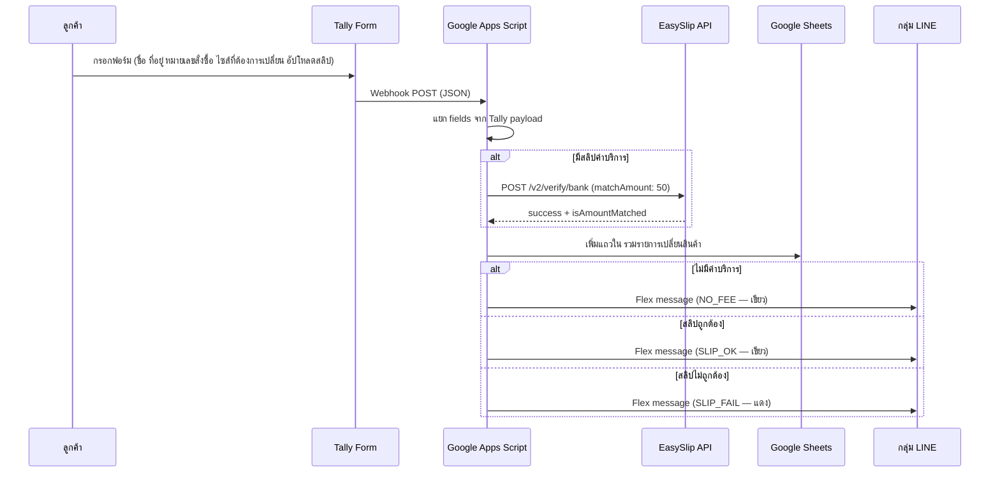

เดิมลูกค้าที่ต้องการเปลี่ยนสินค้าต้องหา ARKA ใน LINE แล้วแจ้งรายละเอียดในแชท โอนเงิน ฿50 แล้วส่งรูปสลิปเอง ฝั่ง ARKA ก็ต้องตรวจสอบและบันทึกข้อมูลเองทั้งหมด แบบฟอร์ม Tally สองฟอร์ม ระบบตรวจสลิปด้วย EasySlip และ LINE Messaging API ตัดขั้นตอนเหล่านั้นออกทั้งหมด

## เกี่ยวกับ ARKA

[ARKA (arka.bkk)](https://www.instagram.com/arka.bkk/) คือร้านเสื้อผ้าผู้หญิงในกรุงเทพฯ ที่ขายสินค้าผ่านหลายช่องทาง:

- **Instagram**: [arka.bkk](https://www.instagram.com/arka.bkk/)
- **Shopee**: [arka.bangkok](https://shopee.co.th/arka.bangkok)
- **TikTok**: [@arka.bkk](https://www.tiktok.com/@arka.bkk)
- **Lazada**: [ARKA Bangkok](https://www.lazada.co.th/shop/k6gz37mz)

## ปัญหา

ลูกค้าที่ต้องการเปลี่ยนไซส์สินค้าต้องออกจากแพลตฟอร์มที่ซื้อ มาหา ARKA ใน LINE แล้วแจ้งรายละเอียดในแชท ถ้าเป็นกรณีที่ต้องชำระค่าบริการ ฿50 ก็ต้องโอนเงินแล้วส่งรูปสลิปในแชทเอง ทีมงานต้องตรวจสลิปเองและบันทึกข้อมูลเองทุกครั้ง ยิ่งมีหลายเคสพร้อมกัน ยิ่งหลุดง่าย

แบ่งเป็น 2 กรณี:

- **ไม่มีค่าบริการ** — ร้านส่งสินค้าผิดหรือสินค้ามีตำหนิ ลูกค้าไม่ต้องชำระค่าบริการ
- **มีค่าบริการ ฿50** — ลูกค้าต้องการเปลี่ยนไซส์เอง มีค่าบริการสำหรับจัดการส่งคืน

## ขั้นตอนการเปลี่ยนสินค้า

ใช้แบบฟอร์ม Tally แยก 2 ฟอร์มสำหรับแต่ละกรณี ทั้งคู่ส่ง webhook มาที่ Google Apps Script เดียวกัน

- [แบบฟอร์มแจ้งเปลี่ยนสินค้า ARKA.BKK (มีค่าบริการ)](https://tally.so/r/yP7QO8)
- [แบบฟอร์มแจ้งเปลี่ยนสินค้า ARKA.BKK](https://tally.so/r/D4WjKq)

<figure>
  <ZoomableImage
    src="/projects/arka-product-return/tally-form-product-return.png"
    alt="แบบฟอร์ม Tally สำหรับแจ้งเปลี่ยนสินค้า"
    className="border border-zinc-200 dark:border-zinc-800"
  />
  <figcaption className="mt-1 text-center text-xs text-zinc-500">
    แบบฟอร์ม Tally — ลูกค้ากรอกชื่อ ที่อยู่ หมายเลขสั่งซื้อ ไซส์ที่ต้องการ และอัปโหลดสลิป (ถ้ามี)
  </figcaption>
</figure>

<figure>
  <ZoomableImage
    src="/projects/arka-product-return/flex-message-noti-when-submission-form.png"
    alt="LINE flex message แจ้งเตือนเมื่อมีการกรอกฟอร์ม"
    className="border border-zinc-200 dark:border-zinc-800"
  />
  <figcaption className="mt-1 text-center text-xs text-zinc-500">
    แจ้งเตือนกลุ่ม LINE — ส่งทันทีที่ลูกค้ากดส่งฟอร์ม สีเขียวสำหรับกรณีสลิปถูกต้องหรือไม่มีค่าบริการ
  </figcaption>
</figure>

<figure>
  <ZoomableImage
    src="/projects/arka-product-return/flex-message-slip-wrong.png"
    alt="LINE flex message เมื่อสลิปไม่ผ่านการตรวจสอบ"
    className="border border-zinc-200 dark:border-zinc-800"
  />
  <figcaption className="mt-1 text-center text-xs text-zinc-500">
    แจ้งเตือนสีแดง — EasySlip คืน success: false หรือจำนวนเงินไม่ตรง ฿50
  </figcaption>
</figure>

## ได้รับสินค้าคืน

เมื่อลูกค้าส่งสินค้าคืนมาถึง ทีมงานติ๊กช่องในแถวนั้นใน Google Sheets trigger `onEdit` ที่ติดตั้งไว้จะส่ง LINE notification แจ้งว่าพร้อมแพ็คสินค้าใหม่แล้ว

<figure>
  <ZoomableImage
    src="/projects/arka-product-return/flex-message-ready-to-pack.png"
    alt="LINE flex message เมื่อได้รับสินค้าคืนเรียบร้อย"
    className="border border-zinc-200 dark:border-zinc-800"
  />
  <figcaption className="mt-1 text-center text-xs text-zinc-500">
    แจ้งเตือน "ได้รับสินค้าคืน" — ส่งอัตโนมัติเมื่อทีมงานติ๊กช่อง "ได้รับสินค้าเรียบร้อย" ใน Sheets
  </figcaption>
</figure>

## รายงานรายวัน

Trigger รายวันสแกนแถวที่ยังไม่ได้รับสินค้าคืน แล้วส่งสรุปเป็น flex message ใน LINE เพื่อไม่ให้หลุดเคสใดเคสหนึ่ง

<figure>
  <ZoomableImage
    src="/projects/arka-product-return/everyday-report.png"
    alt="รายงาน LINE รายวันของเคสที่ยังค้างอยู่"
    className="border border-zinc-200 dark:border-zinc-800"
  />
  <figcaption className="mt-1 text-center text-xs text-zinc-500">
    รายงานประจำวัน — แสดงทุกรายการเปลี่ยนสินค้าที่ยังรอสินค้าคืน
  </figcaption>
</figure>

## พิมพ์ใบปะหน้าพัสดุ

ก่อนส่งสินค้าใหม่ ทีมงานเลือกแถวใน Sheets แล้วกด **Print Tracking** จากเมนู ARKA Tools ระบบจะแสดง label ขนาด 6×4 นิ้ว พร้อมชื่อ เบอร์โทร และที่อยู่ลูกค้า สำหรับพิมพ์หรือบันทึกเป็น PDF

## สิ่งที่จะทำต่างออกไป

ปัญหาที่เจอคือ `getLastRow()` คืนค่า 1000+ แทนที่จะเป็นแถวถัดจากข้อมูลจริง เกิดจากการ `setNumberFormat('@')` กับทั้งคอลัมน์ E ทำให้ Sheets นับว่ามีข้อมูลไปถึงแถวนั้น แก้ไขด้วยการ scope number format ให้แคบลงเฉพาะ range ของข้อมูลจริง

EasySlip ตรวจสอบยอดแบบ strict — ฿49 ก็ fail เหมือนกัน ซึ่งตั้งใจไว้แบบนั้น แต่ถ้าธนาคารปัดเศษผิดพลาด ลูกค้าต้องกรอกฟอร์มใหม่
