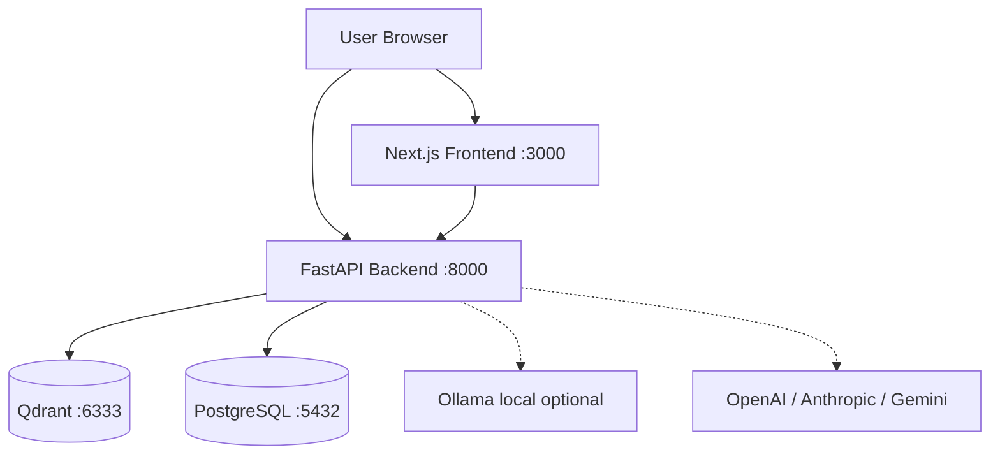

## ปัญหา

เครื่องมือ RAG ส่วนใหญ่บังคับให้เลือกระหว่างความเป็นส่วนตัวและความสามารถ — เครื่องมือบนคลาวด์ส่งเอกสารของคุณไปยังเซิร์ฟเวอร์บุคคลที่สาม ขณะที่ทางเลือกแบบ local ติดตั้งยากและขาดการรองรับ multimodal

DocRAG คือ RAG engine แบบ self-hosted ที่จัดการ PDF, Excel, ไดอะแกรม PlantUML, รูปภาพ, และซอร์สโค้ดในที่เดียว รันได้ทั้งหมดผ่าน Docker — เอกสารของคุณไม่เคยออกจากเครื่อง

## ฟีเจอร์

- **การนำเข้าหลายรูปแบบ** — PDF, DOCX, รูปภาพ (ผ่าน Docling ที่รับรู้ layout), CSV, XLSX, JSON, Markdown, PUML, และซอร์สโค้ด
- **Streaming chat** — การตอบสนองแบบ streaming ผ่าน SSE พร้อมการจำแนกประเภทคำถาม (Document Analyst, Code Architect, Summarizer และอื่น ๆ)
- **การอ้างอิงแหล่งที่มา** — ทุกคำตอบแสดง chunk ของเอกสารที่ใช้เป็น context อย่างชัดเจน
- **Multi-provider LLM** — สลับระหว่าง Ollama (local), OpenAI, Anthropic, และ Gemini ได้จากหน้า Settings โดยไม่ต้องแก้ไข `.env`
- **Self-hosted vector store** — Qdrant v1.17.0 พร้อมรองรับ gRPC สำหรับการนำเข้าข้อมูลความเร็วสูง
- **ประวัติการสนทนา** — บันทึก chat history ครบถ้วนใน PostgreSQL พร้อม export/import
- **ปรับแต่ง RAG แบบ real-time** — ปรับ top-k และ score threshold ได้จากหน้า Settings โดยไม่ต้องรีสตาร์ท

## สถาปัตยกรรมระบบ

## การตัดสินใจทางเทคนิค

| การตัดสินใจ | ที่เลือก | ที่ไม่เลือก | เหตุผล |
| --- | --- | --- | --- |
| การแปลงเอกสาร | Docling | PyMuPDF / pdfplumber | การแปลงที่รับรู้ layout รักษาลำดับการอ่านและจัดการ PDF หลายคอลัมน์ได้ |
| Vector store | Qdrant | ChromaDB / FAISS | รองรับ gRPC, มี dashboard ในตัว, persistence ระดับ production |
| Embedding model | nomic-embed-text-v1.5 (768-dim) | all-MiniLM-L6-v2 (384-dim) | context window 8192 tokens — เหมาะกับ chunk เอกสารขนาดใหญ่ |
| การเก็บ LLM key | PostgreSQL (ตาราง `appsetting`) | `.env` file | จัดการ key ผ่าน UI ได้แบบ real-time โดยไม่ต้องรีสตาร์ท container |
| Streaming | SSE ผ่าน FastAPI `StreamingResponse` | WebSocket | ฝั่ง client ใช้งานง่ายกว่าด้วย `ReadableStream`; ไม่ต้องการ persistent connection |

## สิ่งที่จะทำต่างออกไป

เพิ่มการตรวจสอบเอกสารซ้ำตอนนำเข้า ปัจจุบันการอัปโหลดไฟล์เดิมสองครั้งจะสร้าง vector point ซ้ำ — รายการเอกสารแสดงสองรายการและคุณภาพการค้นหาลดลง การตรวจสอบ content hash ก่อน upsert จะป้องกันปัญหานี้ได้โดยมี overhead น้อยมาก

นอกจากนี้จะเพิ่ม metadata ระดับ chunk ให้ละเอียดกว่าแค่ `file_name` และ `page_number` — Docling ดึง section title และประเภท element ออกมาแล้ว แต่ยังสามารถนำมาใช้เพิ่มความแม่นยำในการค้นหาด้วย metadata filter ได้มากกว่านี้
