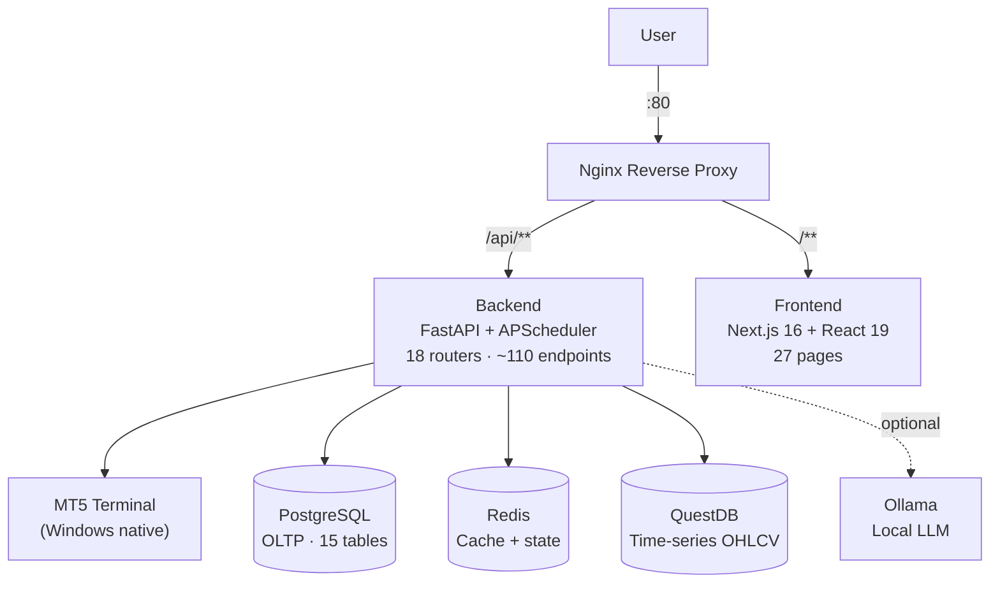

## ปัญหา

การรัน strategy Forex บน MetaTrader 5 ต้องจ้องกราฟ, ตัดสินใจด้วยตนเองว่าสัญญาณไหนใช้ได้, และเปิด terminal ตลอด 24 ชั่วโมง การสลับระหว่าง MT5, สเปรดชีตสำหรับติดตามผลการดำเนินงาน, และแหล่งข่าวต่าง ๆ เป็นเรื่องยุ่งยากและขยายขนาดได้ยาก และไม่มีวิธีถาม LLM ว่า "ควรเปิดออเดอร์นี้ไหม?" พร้อมคำตอบที่ตรวจสอบและบันทึกได้

LLMSystemTrading แทนที่กระบวนการ manual ด้วย pipeline อัตโนมัติครบวงจร: LLM agent ค้นคว้าตลาด, สร้างสัญญาณ, ส่งออเดอร์ไปยัง MT5, และบันทึกทุกการตัดสินใจลงฐานข้อมูลที่ query ได้ — พร้อม dashboard ครบฟีเจอร์สำหรับติดตามและควบคุม

## สถาปัตยกรรมระบบ

Frontend และ backend รันใน Docker ร่วมกับฐานข้อมูลสามตัว MT5 รัน native บน Windows — `python-mt5` เชื่อมต่อผ่าน local socket Nginx จัดการ traffic ทั้งหมด: `/api/**` proxy ไปยัง FastAPI ส่วนที่เหลือไปยัง Next.js SSR server

## Multi-Agent LLM Pipeline

แต่ละ scheduled run ผ่าน agent chain แบบลำดับ:

| ขั้นตอน | Agent | ผลลัพธ์ |
|---------|-------|---------|
| 1. Research | Market Research Agent | ความรู้สึกของข่าว, บริบทมหภาค |
| 2. Analysis | Market Analysis Agent | สรุป chart pattern + indicator |
| 3. Signal | Signal Generation Agent | BUY / SELL / HOLD + ค่าความมั่นใจ |
| 4. Execution | MT5 Bridge | วางออเดอร์, บันทึก ticket |
| 5. Audit | LLM Audit Logger | บันทึก token trace ครบถ้วนลง `llm_calls` + `ai_journal` |

APScheduler เปิด chain ตาม cron interval ที่กำหนดได้ต่อ strategy ทุก LLM call บันทึก provider, model, token count, ต้นทุน, และ response ครบถ้วน — ดูได้ในหน้า LLM Analytics และ LLM Usage

## ฟีเจอร์

| หน้า | หน้าที่ |
|------|---------|
| Dashboard | ออเดอร์ live, P&L, equity บัญชี, WebSocket clock |
| Accounts | credential MT5 และ config การเทรดต่อบัญชี |
| Strategies | กำหนด strategy พร้อม LLM override และพารามิเตอร์ความเสี่ยง |
| Backtest | รันและเปรียบเทียบ backtest ประวัติพร้อม metrics ครบถ้วน |
| LLM Analytics | ความแม่นยำสัญญาณต่อ agent, การกระจาย confidence |
| LLM Usage | การใช้ token และต้นทุนแยกตาม provider/model |
| Schedule | ดูและควบคุม cron job ของ APScheduler |
| Pipeline Logs | trace การรัน pipeline แบบ step-by-step |
| News | รวมข้อมูลข่าวที่ใช้โดย research agent |
| Analytics | P&L รวม, win rate, drawdown chart |
| Trades | ประวัติการเทรดครบถ้วนพร้อม entry/exit/ticket |
| Settings | ตั้งค่าความเสี่ยงทั่วไป, แจ้งเตือน Telegram, key LLM provider |
| Storage | จัดการข้อมูล candle ใน QuestDB |
| System Usage | การใช้งาน CPU, memory, และ disk ของ host |

## การตัดสินใจทางเทคนิค

| การตัดสินใจ | ที่เลือก | ที่ไม่เลือก | เหตุผล |
|-------------|---------|------------|--------|
| Time-series storage | QuestDB | PostgreSQL สำหรับทุกอย่าง | การ insert candle OHLCV ผ่าน InfluxDB line protocol เร็วกว่า columnar TSDB มาก |
| Job scheduling | APScheduler | Celery + RabbitMQ | Deploy บนเครื่องเดียว; APScheduler รัน in-process ไม่มี infra overhead |
| MT5 connection | python-mt5 (native) | Docker container | MT5 เป็น Windows application ไม่สามารถรันใน container ได้ |
| LLM provider | แบบ abstracted (Anthropic / OpenAI / Gemini / OpenRouter) | Hard-coded provider | สลับ model ต่อ task ได้โดยไม่ต้องแก้โค้ด |
| การเก็บ LLM key | Fernet-encrypted ใน DB | Plain env vars | Key อยู่รอดหลัง container rebuild; แสดงแบบ masked ใน UI |
| Frontend state | Zustand | Redux / React Query | เบา, ไม่มี boilerplate; เหมาะกับ dashboard 27 หน้า |

## Screenshots

<ScreenshotGrid>

  <figure>
    <ZoomableImage
      src="/projects/llmsystemtrading/dashboard-page.png"
      alt="Dashboard — live positions and account equity"
      className="border border-zinc-200 dark:border-zinc-800"
    />
    <figcaption className="mt-1 text-center text-xs text-zinc-500">
      Dashboard
    </figcaption>
  </figure>

  <figure>
    <ZoomableImage
      src="/projects/llmsystemtrading/account-page.png"
      alt="Accounts — MT5 credentials and trading config"
      className="border border-zinc-200 dark:border-zinc-800"
    />
    <figcaption className="mt-1 text-center text-xs text-zinc-500">
      Accounts
    </figcaption>
  </figure>

  <figure>
    <ZoomableImage
      src="/projects/llmsystemtrading/analytics-page.png"
      alt="Analytics — P&L and win rate charts"
      className="border border-zinc-200 dark:border-zinc-800"
    />
    <figcaption className="mt-1 text-center text-xs text-zinc-500">
      Analytics
    </figcaption>
  </figure>

  <figure>
    <ZoomableImage
      src="/projects/llmsystemtrading/backtest-page.png"
      alt="Backtest — historical strategy performance"
      className="border border-zinc-200 dark:border-zinc-800"
    />
    <figcaption className="mt-1 text-center text-xs text-zinc-500">
      Backtest
    </figcaption>
  </figure>

  <figure>
    <ZoomableImage
      src="/projects/llmsystemtrading/llm-usage-page.png"
      alt="LLM Usage — token consumption and cost by provider"
      className="border border-zinc-200 dark:border-zinc-800"
    />
    <figcaption className="mt-1 text-center text-xs text-zinc-500">
      LLM Usage
    </figcaption>
  </figure>

  <figure>
    <ZoomableImage
      src="/projects/llmsystemtrading/mt5-screenshot.png"
      alt="MetaTrader 5 — connected terminal"
      className="border border-zinc-200 dark:border-zinc-800"
    />
    <figcaption className="mt-1 text-center text-xs text-zinc-500">
      MT5 Terminal
    </figcaption>
  </figure>

  <figure>
    <ZoomableImage
      src="/projects/llmsystemtrading/pipeline-log-page.png"
      alt="Pipeline Logs — step-by-step agent execution trace"
      className="border border-zinc-200 dark:border-zinc-800"
    />
    <figcaption className="mt-1 text-center text-xs text-zinc-500">
      Pipeline Logs
    </figcaption>
  </figure>

</ScreenshotGrid>

## สิ่งที่จะทำต่างออกไป

ย้ายไปใช้ Celery กับ Redis broker ตั้งแต่ต้น APScheduler สะดวกสำหรับเครื่องเดียว แต่พอต้องการ instance ที่สองมาแชร์ job queue — หรือต้องการส่ง run ไปยัง worker process อื่น — มันกลายเป็น bottleneck การออกแบบรอบ message queue ตั้งแต่วันแรกจะทำให้ horizontal scaling ง่ายขึ้น

นอกจากนี้จะเพิ่ม authentication ก่อนสร้างฟีเจอร์ใด ๆ ระบบปัจจุบันไม่มี auth layer — ปลอดภัยอยู่หลัง firewall แต่การเพิ่มภายหลังข้าม 27 หน้าและ ~110 endpoint ต้องใช้ความพยายามมากกว่าการเดินสาย route ตั้งแต่แรก
