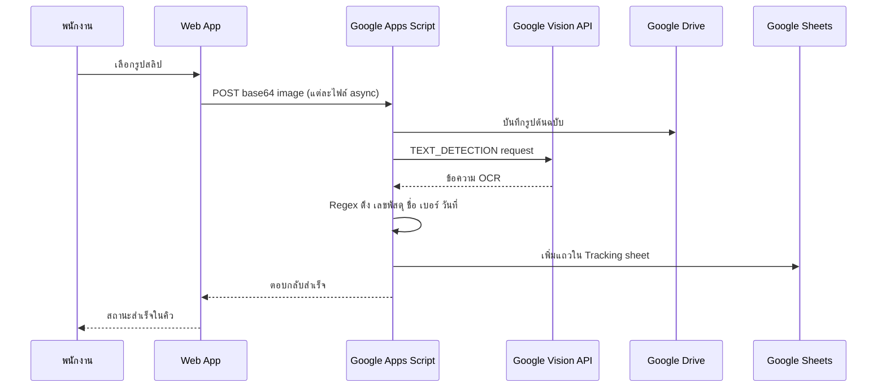
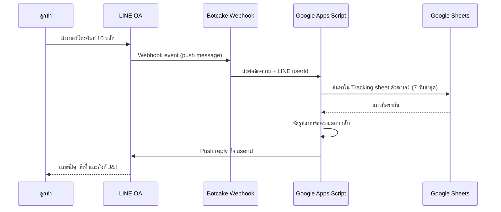

น้องสาวผมเปิดร้านเสื้อผ้า ARKA ขายผ่านหลายช่องทาง ทั้ง Shopee, TikTok, Lazada, Instagram และ Facebook ออเดอร์จากโซเชียลมีเดียส่งผ่าน J&T Express ซึ่งไม่มีระบบเชื่อมต่อกับแพลตฟอร์มใดเลย สร้างระบบนี้ภายในวันเดียว (6–8 ชั่วโมง) เพื่อตัดงานกรอกข้อมูลซ้ำออกไปทั้งหมด

## เกี่ยวกับ ARKA

[ARKA (arka.bkk)](https://www.instagram.com/arka.bkk/) ร้านเสื้อผ้าผู้หญิงในกรุงเทพฯ ขายผ่านสี่แพลตฟอร์ม:

- **Instagram**: [arka.bkk](https://www.instagram.com/arka.bkk/)
- **Shopee**: [arka.bangkok](https://shopee.co.th/arka.bangkok)
- **TikTok**: [@arka.bkk](https://www.tiktok.com/@arka.bkk)
- **Lazada**: [ARKA Bangkok](https://www.lazada.co.th/shop/k6gz37mz)

## ปัญหา

Shopee, TikTok และ Lazada มีระบบติดตามพัสดุในตัว — เลขพัสดุอัปเดตอัตโนมัติ แต่ออเดอร์จาก Instagram และ Facebook ไม่มี ต้องส่งผ่าน J&T Express เอง พนักงาน J&T จะส่งมอบสลิปพิมพ์ที่มีชื่อลูกค้า เบอร์โทร และเลขพัสดุ

เดิมต้องมีคนอ่านสลิปแล้วกรอกข้อมูลด้วยมือ วันละหลายสิบใบ เสียเวลาและเสี่ยงพิมพ์ผิด ทำให้ลูกค้าตามพัสดุไม่เจอ

## ขั้นตอนอัปโหลดของพนักงาน

พนักงาน J&T ถ่ายรูปสลิปแล้วเปิด Web App เลือกรูปได้หลายใบพร้อมกัน แต่ละไฟล์ส่งขึ้นแบบ Async คู่ขนาน

<figure>
  <ZoomableImage
    src="/projects/tracking-arka/J_T-upload-image-tracking.jpg"
    alt="สลิป J&T Express แสดงชื่อลูกค้า เลขพัสดุ และเบอร์โทรศัพท์"
    className="border border-zinc-200 dark:border-zinc-800"
  />
  <figcaption className="mt-1 text-center text-xs text-zinc-500">
    สลิป J&T — ข้อมูลดิบที่ Google Vision API อ่าน
  </figcaption>
</figure>

<figure>
  <ZoomableImage
    src="/projects/tracking-arka/arka-web-upload-images.png"
    alt="หน้าอัปโหลดของ ARKA Web App"
    className="border border-zinc-200 dark:border-zinc-800"
  />
  <figcaption className="mt-1 text-center text-xs text-zinc-500">
    หน้าอัปโหลด — กดเพื่อถ่ายรูปหรือเลือกไฟล์
  </figcaption>
</figure>

<figure>
  <ZoomableImage
    src="/projects/tracking-arka/arka-web-upload-images-queue.png"
    alt="คิวไฟล์ที่กำลังประมวลผลพร้อมกัน"
    className="border border-zinc-200 dark:border-zinc-800"
  />
  <figcaption className="mt-1 text-center text-xs text-zinc-500">
    คิวงาน — หลายสลิปประมวลผลพร้อมกัน
  </figcaption>
</figure>

<figure>
  <ZoomableImage
    src="/projects/tracking-arka/arka-web-upload-images-done.png"
    alt="อัปโหลดสำเร็จทั้งหมด"
    className="border border-zinc-200 dark:border-zinc-800"
  />
  <figcaption className="mt-1 text-center text-xs text-zinc-500">
    เสร็จสมบูรณ์ — แต่ละแถวแสดงสถานะสำเร็จ
  </figcaption>
</figure>

## ลูกค้าตรวจพัสดุผ่าน LINE OA

ลูกค้าส่งเบอร์โทรศัพท์ 10 หลักหา LINE OA ของ ARKA ระบบค้นหาออเดอร์ย้อนหลัง 7 วัน แล้วตอบกลับพร้อมเลขพัสดุและลิงก์ติดตามจาก J&T โดยตรง

<figure>
  <ZoomableImage
    src="/projects/tracking-arka/line-oa-arka-tracking.PNG"
    alt="LINE OA ของ ARKA"
    className="border border-zinc-200 dark:border-zinc-800"
  />
  <figcaption className="mt-1 text-center text-xs text-zinc-500">
    LINE OA ของ ARKA — จุดเริ่มต้นสำหรับลูกค้า
  </figcaption>
</figure>

<figure>
  <ZoomableImage
    src="/projects/tracking-arka/line-oa-arka-tracking-output.PNG"
    alt="ผลลัพธ์จาก LINE OA แสดงเลขพัสดุและลิงก์ J&T"
    className="border border-zinc-200 dark:border-zinc-800"
  />
  <figcaption className="mt-1 text-center text-xs text-zinc-500">
    ตอบกลับ — เลขพัสดุ วันที่ และลิงก์ J&T โดยตรง
  </figcaption>
</figure>

<figure>
  <ZoomableImage
    src="/projects/tracking-arka/line-oa-arka-click-tracking-J_T.PNG"
    alt="ลูกค้ากดปุ่มตรวจพัสดุ J&T ใน LINE OA"
    className="border border-zinc-200 dark:border-zinc-800"
  />
  <figcaption className="mt-1 text-center text-xs text-zinc-500">
    ลูกค้าค้นหาสถานะพัสดุด้วยเบอร์โทร
  </figcaption>
</figure>

## ข้อมูลใน Google Sheets

สลิปแต่ละใบสร้างหนึ่งแถว: วันเวลา เลขพัสดุ ชื่อลูกค้า เบอร์โทร วันที่บนสลิป ลิงก์ J&T สถานะการประมวลผล และลิงก์รูปต้นฉบับใน Google Drive

<figure>
  <ZoomableImage
    src="/projects/tracking-arka/spreadsheet-tracking-1.png"
    alt="Google Sheets ข้อมูลติดตามพัสดุ"
    className="border border-zinc-200 dark:border-zinc-800"
  />
  <figcaption className="mt-1 text-center text-xs text-zinc-500">
    Tracking sheet — หนึ่งแถวต่อหนึ่งสลิป J&T
  </figcaption>
</figure>

<figure>
  <ZoomableImage
    src="/projects/tracking-arka/spreadsheet-tracking-2.png"
    alt="Google Sheets รายละเอียดข้อมูล"
    className="border border-zinc-200 dark:border-zinc-800"
  />
  <figcaption className="mt-1 text-center text-xs text-zinc-500">
    แต่ละแถวลิงก์ถึงรูปสลิปต้นฉบับใน Google Drive
  </figcaption>
</figure>

## สิ่งที่จะทำต่างออกไป

Regex extraction ทำงานได้ดีกับรูปแบบสลิป J&T ปัจจุบัน แต่เปราะบาง — หาก J&T เปลี่ยนเลย์เอาต์สลิปจะพังทันที วิธีที่แข็งแกร่งกว่าคือใช้ bounding-box coordinates จาก Vision API เพื่อหาตำแหน่งฟิลด์แทนการจับคู่ข้อความ

LINE OA เชื่อมผ่าน Botcake เป็น webhook proxy ซึ่งเพิ่ม dependency นอกการควบคุม วิธีที่ดีกว่าในระยะยาวคือเชื่อมตรงกับ LINE Messaging API
