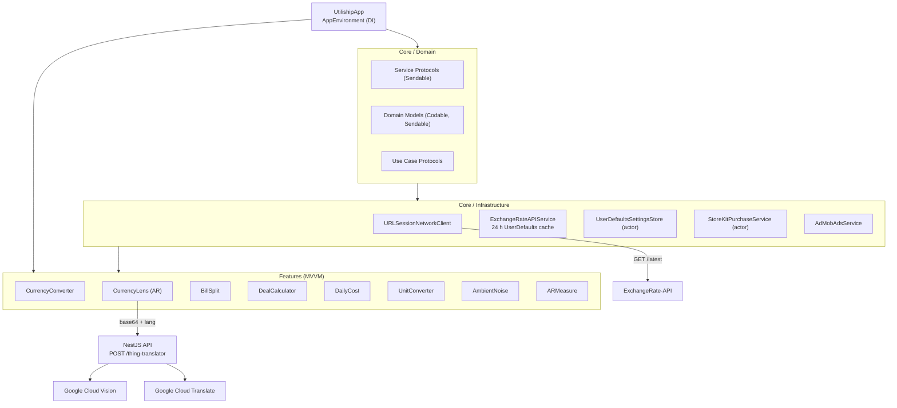

## ปัญหา

ทุก utility app บนโทรศัพท์ทำได้แค่อย่างเดียว: แปลงสกุลเงินที่นี่, หารบิลที่นั่น, แปลงหน่วยที่อื่น การสลับระหว่างห้าแอปแค่เพื่อหารบิลในร้านอาหารแล้วแปลงยอดรวมเป็นสกุลเงินบ้านดูไร้สาระ Utiliship คือแอปเดียวที่รวมทุกอย่าง — และมากกว่านั้น

## ฟีเจอร์

- **Currency Converter** — อัตราแลกเปลี่ยน real-time ผ่าน ExchangeRate-API, cache 24 ชั่วโมงสำหรับใช้ offline, แปลงหลายสกุลพร้อมกัน, preset คู่สกุลเงิน, และ home-screen widget
- **Currency Lens** — ชี้กล้องไปที่ป้ายราคา; AR overlay แสดงยอดแปลงสกุลเงินแบบ live
- **Bill Splitter** — wizard สามขั้นตอน: เพิ่มผู้เข้าร่วม, กำหนดรายการต่อคน, ได้ยอดต่อคนพร้อมการปัดเศษที่กำหนดได้; บันทึกประวัติอัตโนมัติ
- **Deal Calculator** — เปรียบเทียบสินค้าได้ถึง 10 ชิ้นตามราคาต่อหน่วยในน้ำหนัก, ปริมาณ, พื้นที่, และอื่น ๆ
- **Daily Cost** — ใส่ราคาซื้อและวันที่เริ่ม; ดูต้นทุนค่าเสื่อมราคารายวัน/สัปดาห์/เดือน
- **Unit Converter** — ความยาว, น้ำหนัก, อุณหภูมิ, พื้นที่, ปริมาตร, ความเร็ว, ขนาดข้อมูล — metric และ imperial
- **Ambient Noise Meter** — ระดับ dB real-time พร้อมสถิติ min/max/average
- **AR Measure** — walk mode (camera odometry) และ visual mode (ARKit plane detection) สำหรับวัดระยะและพื้นผิว
- **Thing Translator** — ชี้ที่วัตถุใด ๆ; Google Vision ระบุและ Google Translate ตั้งชื่อในภาษาของคุณ
- **Settings** — สกุลเงินที่ต้องการ, ระบบการวัด, ธีม, และ Pro subscription ผ่าน StoreKit 2

## สถาปัตยกรรมระบบ

## การตัดสินใจทางเทคนิค

| การตัดสินใจ | ที่เลือก | ที่ไม่เลือก | เหตุผล |
|-------------|---------|------------|--------|
| Concurrency | Swift 6 strict mode | Swift 5 + manual lock | ความปลอดภัยจาก data race ตอน compile; ทุก service เป็น Sendable |
| DI | `AppEnvironment` env key | Singleton / service locator | ทดสอบได้, ไม่มี global state, native กับ SwiftUI |
| Rate caching | UserDefaults (24 h TTL) | Core Data / SQLite | อัตราคือ JSON blob ชิ้นเดียว; UserDefaults เพียงพอ |
| Object recognition | Google Cloud Vision | CoreML VisionKit | ความแม่นยำของ label สูงกว่ามากสำหรับวัตถุในโลกจริงทั่วไป |
| Monetisation | StoreKit 2 + AdMob | Web paywall | Native IAP จำเป็นสำหรับ App Store; AdMob สำหรับ tier ฟรี |
| Backend | NestJS (TypeScript) | Python / FastAPI | Stack คุ้นเคย, Docker-friendly, thin proxy layer |

## Screenshots

<ScreenshotGrid>

  <figure>
    <ZoomableImage
      src="/projects/utiliship/home-view.PNG"
      alt="Home screen utility grid"
      className="border border-zinc-200 dark:border-zinc-800"
    />
    <figcaption className="mt-1 text-center text-xs text-zinc-500">
      หน้าหลัก
    </figcaption>
  </figure>

  <figure>
    <ZoomableImage
      src="/projects/utiliship/currency-converter-view.PNG"
      alt="Currency converter with multi-target results"
      className="border border-zinc-200 dark:border-zinc-800"
    />
    <figcaption className="mt-1 text-center text-xs text-zinc-500">
      แปลงสกุลเงิน
    </figcaption>
  </figure>

  <figure>
    <ZoomableImage
      src="/projects/utiliship/ar-currency-converter.PNG"
      alt="AR Currency Lens overlaying converted prices on camera"
      className="border border-zinc-200 dark:border-zinc-800"
    />
    <figcaption className="mt-1 text-center text-xs text-zinc-500">
      Currency Lens (AR)
    </figcaption>
  </figure>

  <figure>
    <ZoomableImage
      src="/projects/utiliship/bill-setup-view.PNG"
      alt="Bill splitter setup — participants and charges"
      className="border border-zinc-200 dark:border-zinc-800"
    />
    <figcaption className="mt-1 text-center text-xs text-zinc-500">
      หารบิล — ตั้งค่า
    </figcaption>
  </figure>

  <figure>
    <ZoomableImage
      src="/projects/utiliship/bill-splitter-view-1.PNG"
      alt="Bill splitter item assignment"
      className="border border-zinc-200 dark:border-zinc-800"
    />
    <figcaption className="mt-1 text-center text-xs text-zinc-500">
      หารบิล — รายการ
    </figcaption>
  </figure>

  <figure>
    <ZoomableImage
      src="/projects/utiliship/bill-splitter-view-2.PNG"
      alt="Bill splitter result per person"
      className="border border-zinc-200 dark:border-zinc-800"
    />
    <figcaption className="mt-1 text-center text-xs text-zinc-500">
      หารบิล — ผลลัพธ์
    </figcaption>
  </figure>

  <figure>
    <ZoomableImage
      src="/projects/utiliship/deal-calculator-1.PNG"
      alt="Deal calculator item entry"
      className="border border-zinc-200 dark:border-zinc-800"
    />
    <figcaption className="mt-1 text-center text-xs text-zinc-500">
      คำนวณดีล
    </figcaption>
  </figure>

  <figure>
    <ZoomableImage
      src="/projects/utiliship/daily-cost-view.PNG"
      alt="Daily cost depreciation calculator"
      className="border border-zinc-200 dark:border-zinc-800"
    />
    <figcaption className="mt-1 text-center text-xs text-zinc-500">
      ต้นทุนรายวัน
    </figcaption>
  </figure>

  <figure>
    <ZoomableImage
      src="/projects/utiliship/unit-converter-view.PNG"
      alt="Unit converter with category picker"
      className="border border-zinc-200 dark:border-zinc-800"
    />
    <figcaption className="mt-1 text-center text-xs text-zinc-500">
      แปลงหน่วย
    </figcaption>
  </figure>

  <figure>
    <ZoomableImage
      src="/projects/utiliship/ambient-noise-view.PNG"
      alt="Ambient noise meter with dB gauge"
      className="border border-zinc-200 dark:border-zinc-800"
    />
    <figcaption className="mt-1 text-center text-xs text-zinc-500">
      วัดเสียงรอบข้าง
    </figcaption>
  </figure>

  <figure>
    <ZoomableImage
      src="/projects/utiliship/ar-measure-wall.PNG"
      alt="AR measure — wall surface detection"
      className="border border-zinc-200 dark:border-zinc-800"
    />
    <figcaption className="mt-1 text-center text-xs text-zinc-500">
      AR Measure
    </figcaption>
  </figure>

  <figure>
    <ZoomableImage
      src="/projects/utiliship/settings-view.PNG"
      alt="Settings screen with Pro upgrade"
      className="border border-zinc-200 dark:border-zinc-800"
    />
    <figcaption className="mt-1 text-center text-xs text-zinc-500">
      Settings
    </figcaption>
  </figure>

  <figure>
    <ZoomableImage
      src="/projects/utiliship/currency-widget.PNG"
      alt="Home screen currency widget"
      className="border border-zinc-200 dark:border-zinc-800"
    />
    <figcaption className="mt-1 text-center text-xs text-zinc-500">
      Widget
    </figcaption>
  </figure>

</ScreenshotGrid>

## สิ่งที่จะทำต่างออกไป

เริ่มต้นด้วย design system ก่อน ต้องสร้าง `AppColors` และ `Spacing` ใหม่ถึงสามครั้งเมื่อจำนวนฟีเจอร์เพิ่มขึ้น — แต่ละฟีเจอร์มีสมมติฐาน layout ที่แตกต่างกันฝังอยู่ design system แบบ token-based ที่กำหนดตั้งแต่ต้นจะช่วยประหยัดงานซ้ำนั้นได้

นอกจากนี้จะเพิ่ม coordinator pattern สำหรับ navigation ตั้งแต่วันแรก การใช้ `AppRoute` โดยตรงใน `HomeView` ได้ผลสำหรับสิบฟีเจอร์ แต่การเพิ่ม deep link เผยให้เห็นว่าการผสม logic navigation ไว้ใน view ทำให้ยุ่งยาก coordinator เฉพาะจะเป็นเจ้าของการตัดสินใจ routing ทั้งหมดอย่างสะอาด
