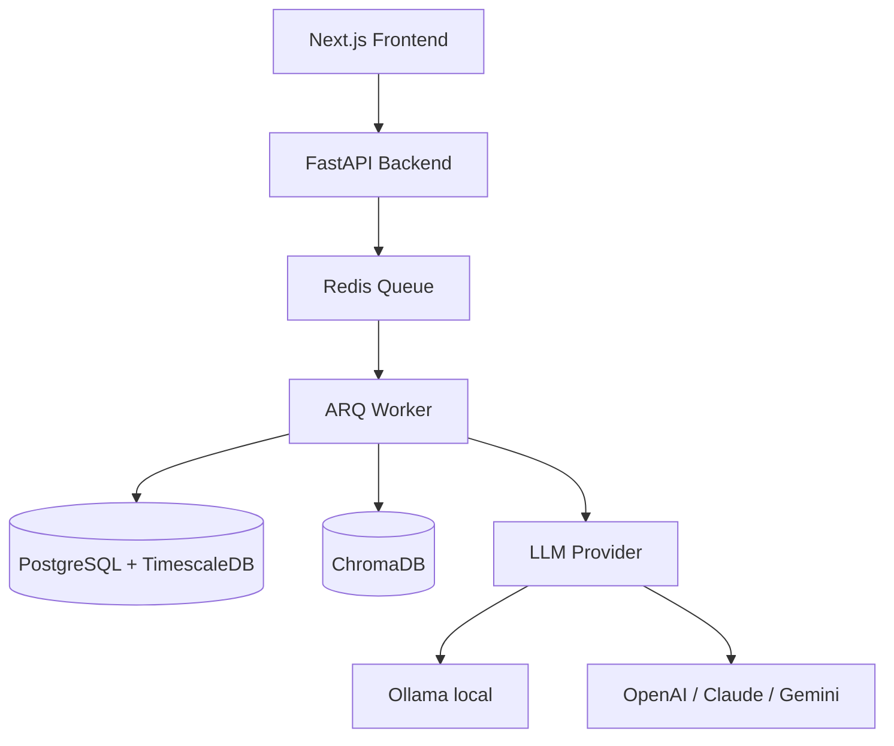

## ปัญหา

การจัดการพอร์ตสินทรัพย์ข้ามหุ้นไทย, หุ้น US, คริปโต, กองทุนรวม, และทองคำต้องสลับระหว่างห้าแอปที่แตกต่างกัน — ไม่มีแอปไหนคุยกัน และไม่มีแอปไหนให้คำตอบที่ชัดเจนสำหรับ: _ตอนนี้ควรทำอะไร?_

Zentri คือ financial OS แบบ self-host ที่รวบรวมทุกอย่างในที่เดียวและตอบคำถามนั้นด้วย LLM รันได้ทั้งหมดบนเครื่องของคุณผ่าน Docker — ข้อมูลของคุณไม่เคยออกจากระบบ

## ฟีเจอร์

- **ติดตามหลายสินทรัพย์** — หุ้นไทย (SET), หุ้น US, คริปโต, กองทุนรวม, ทองคำ
- **วิเคราะห์ด้วย AI** — คำแนะนำ buy/sell/hold ต่อสินทรัพย์พร้อมเหตุผลผ่าน Claude, GPT-4, Gemini, หรือ Ollama local
- **Two-tier LLM routing** — model local ที่เร็วสำหรับสแกนด่วน, model cloud สำหรับวิเคราะห์ลึก
- **Document RAG** — อัปโหลด fund fact sheet และรายงานประจำปี; LLM อ้างอิงในการวิเคราะห์
- **Conversational chat** — ถามคำถามเกี่ยวกับพอร์ตด้วยภาษาธรรมดา
- **Net worth timeline** — snapshot ความมั่งคั่งทั้งหมดรายวันข้ามทุกประเภทสินทรัพย์
- **Watchlist พร้อม AI thesis** — ติดตามสินทรัพย์ที่ยังไม่ได้ถือพร้อม thesis การเข้าซื้อที่ AI สร้าง
- **IPO calendar** — IPO ที่กำลังจะมาพร้อมการวิเคราะห์ด้วย AI
- **Dividend calendar** — ติดตาม dividend ที่กำลังจะมาและที่ได้รับแล้ว
- **CSV import** — แมป CSV format ของโบรกเกอร์อัตโนมัติด้วย LLM column detection

## สถาปัตยกรรมระบบ

## การตัดสินใจทางเทคนิค

| การตัดสินใจ | ที่เลือก | ที่ไม่เลือก | เหตุผล |
| --- | --- | --- | --- |
| Job queue | Redis + ARQ | Celery | ง่ายกว่า, ไม่ต้องการ broker แยก |
| Vector store | ChromaDB | Pinecone | Local-first, ไม่มีค่าใช้จ่าย |
| LLM routing | Two-tier | Single model | Trade-off ระหว่างต้นทุนและคุณภาพ |
| Time-series | TimescaleDB | InfluxDB | อยู่ใน PostgreSQL ecosystem |
| Auth | JWT + bcrypt | OAuth | Self-hosted, single-user |

## Screenshots

<ScreenshotGrid>

  <figure>
    <ZoomableImage
      src="/projects/zentri/watchlist-page.png"
      alt="Watchlist with AI thesis"
      className="border border-zinc-200 dark:border-zinc-800"
    />
    <figcaption className="mt-1 text-center text-xs text-zinc-500">
      Watchlist
    </figcaption>
  </figure>

  <figure>
    <ZoomableImage
      src="/projects/zentri/chat-page.png"
      alt="AI chat interface"
      className="border border-zinc-200 dark:border-zinc-800"
    />
    <figcaption className="mt-1 text-center text-xs text-zinc-500">
      AI Chat
    </figcaption>
  </figure>

  <figure>
    <ZoomableImage
      src="/projects/zentri/overview-page.png"
      alt="Overview dashboard"
      className="border border-zinc-200 dark:border-zinc-800"
    />
    <figcaption className="mt-1 text-center text-xs text-zinc-500">
      ภาพรวม Dashboard
    </figcaption>
  </figure>

  <figure>
    <ZoomableImage
      src="/projects/zentri/ai-usage-page.png"
      alt="AI usage and token tracking"
      className="border border-zinc-200 dark:border-zinc-800"
    />
    <figcaption className="mt-1 text-center text-xs text-zinc-500">
      การใช้งาน AI
    </figcaption>
  </figure>

  <figure>
    <ZoomableImage
      src="/projects/zentri/settings-general-page.png"
      alt="General settings"
      className="border border-zinc-200 dark:border-zinc-800"
    />
    <figcaption className="mt-1 text-center text-xs text-zinc-500">
      Settings
    </figcaption>
  </figure>

  <figure>
    <ZoomableImage
      src="/projects/zentri/events-page.png"
      alt="IPO and dividend events calendar"
      className="border border-zinc-200 dark:border-zinc-800"
    />
    <figcaption className="mt-1 text-center text-xs text-zinc-500">
      ปฏิทิน Events
    </figcaption>
  </figure>

  <figure>
    <ZoomableImage
      src="/projects/zentri/transaction-page.png"
      alt="Transaction history"
      className="border border-zinc-200 dark:border-zinc-800"
    />
    <figcaption className="mt-1 text-center text-xs text-zinc-500">
      ประวัติ Transaction
    </figcaption>
  </figure>

  <figure>
    <ZoomableImage
      src="/projects/zentri/pipeline-page.png"
      alt="Background job pipeline"
      className="border border-zinc-200 dark:border-zinc-800"
    />
    <figcaption className="mt-1 text-center text-xs text-zinc-500">
      Background Pipeline
    </figcaption>
  </figure>

  <figure>
    <ZoomableImage
      src="/projects/zentri/portfolio-page.png"
      alt="Portfolio breakdown"
      className="border border-zinc-200 dark:border-zinc-800"
    />
    <figcaption className="mt-1 text-center text-xs text-zinc-500">
      Portfolio Breakdown
    </figcaption>
  </figure>

</ScreenshotGrid>

## สิ่งที่จะทำต่างออกไป

เริ่มต้นด้วย data pipeline ก่อน UI ใช้เวลาสองสัปดาห์สร้าง dashboard สวยงามก่อนที่จะรู้ว่า data ingestion ไม่น่าเชื่อถือ — ความสวยงามไม่มีความหมายหากไม่มีข้อมูลที่เชื่อถือได้รองรับ

นอกจากนี้จะเพิ่ม end-to-end integration test ตั้งแต่วันแรก LLM pipeline มีหลายส่วนประกอบ (queue → worker → LLM → DB) และ unit test ไม่สามารถจับ integration failure ได้
