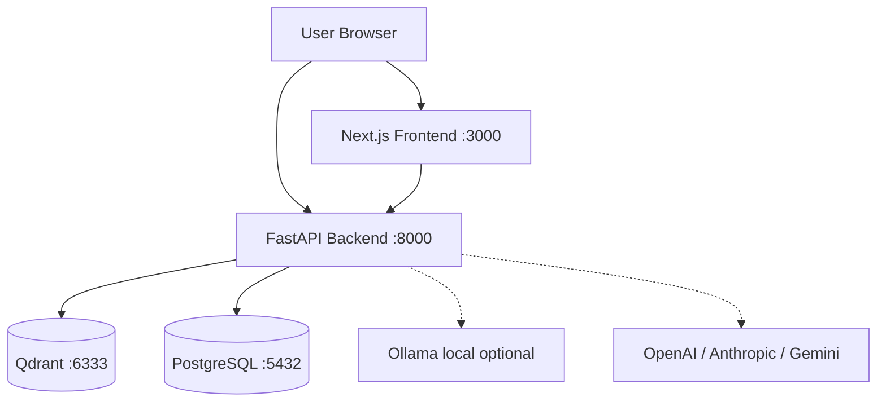
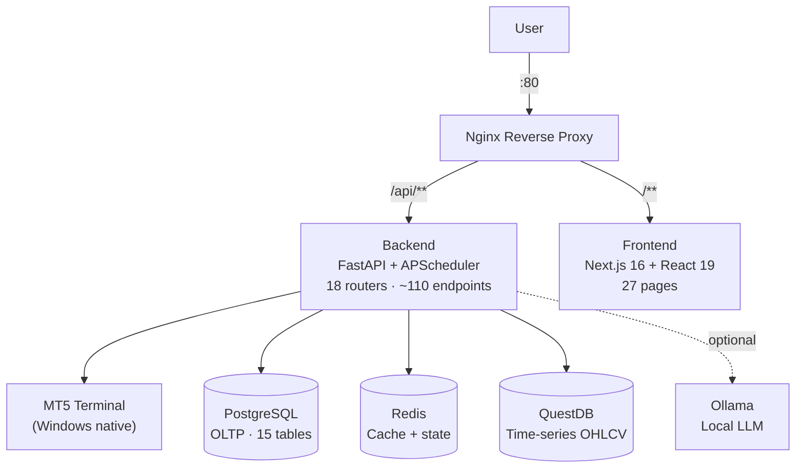
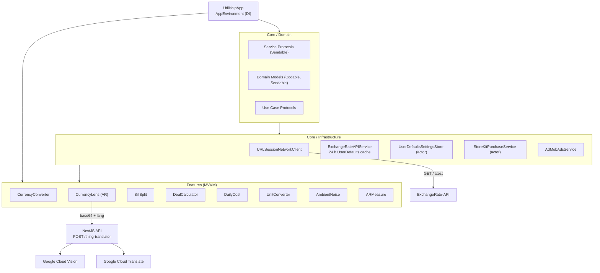
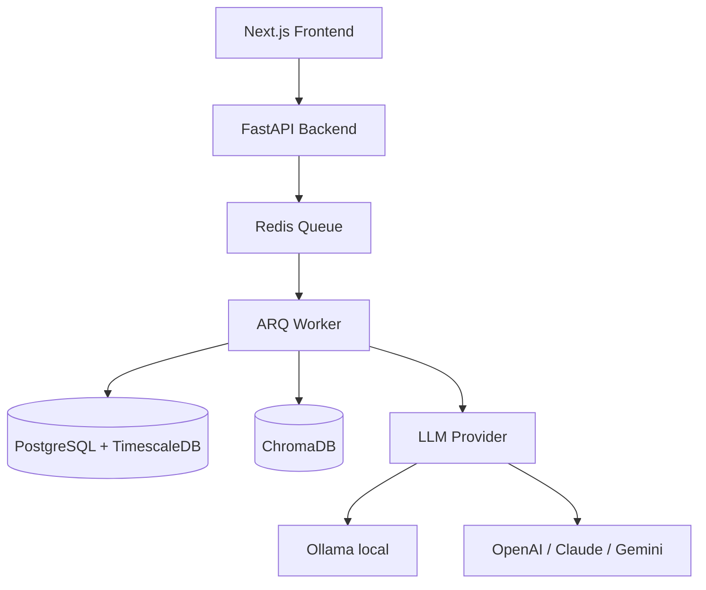

# Thai Projects + Docs Locale Switcher Implementation Plan

> **For agentic workers:** REQUIRED SUB-SKILL: Use superpowers:subagent-driven-development (recommended) or superpowers:executing-plans to implement this plan task-by-task. Steps use checkbox (`- [ ]`) syntax for tracking.

**Goal:** Add Thai-language content for all 9 projects, and hide the locale switcher in the navbar when on any `/docs/` route.

**Architecture:** Two independent changes — (1) create `content/th/projects/*.mdx` files with translated description and body (mermaid blocks preserved verbatim); (2) add a one-line early return in `LocaleSwitcher.tsx` that checks `usePathname()`.

**Tech Stack:** Next.js 16, next-intl, MDX, TypeScript

---

## File Map

| Action | File |
|--------|------|
| Modify | `src/components/shared/LocaleSwitcher.tsx` |
| Create | `content/th/projects/docrag.mdx` |
| Create | `content/th/projects/llmsystemtrading.mdx` |
| Create | `content/th/projects/n8n-watchlist-tracking.mdx` |
| Create | `content/th/projects/pompkins-food-ios.mdx` |
| Create | `content/th/projects/pompkins-food-web.mdx` |
| Create | `content/th/projects/pompkins-merchant-portal.mdx` |
| Create | `content/th/projects/pompkins-web.mdx` |
| Create | `content/th/projects/utiliship.mdx` |
| Create | `content/th/projects/zentri.mdx` |

---

## Task 1: Hide Locale Switcher on Docs Pages

**Files:**
- Modify: `src/components/shared/LocaleSwitcher.tsx`

- [ ] **Step 1: Add early return when on a docs path**

Replace the existing `LocaleSwitcher` function body:

```tsx
'use client'

import { useLocale } from 'next-intl'
import { usePathname, useRouter } from 'next/navigation'

export function LocaleSwitcher() {
  const locale = useLocale()
  const router = useRouter()
  const pathname = usePathname()

  if (pathname.includes('/docs/')) return null

  function switchLocale() {
    const next = locale === 'en' ? 'th' : 'en'
    const segments = pathname.split('/')
    segments[1] = next
    router.push(segments.join('/'))
  }

  return (
    <button
      onClick={switchLocale}
      className="cursor-pointer px-2 py-1 text-sm text-zinc-400 hover:text-zinc-50 dark:text-zinc-500 dark:hover:text-zinc-900 focus-visible:outline-none focus-visible:ring-2 focus-visible:ring-zinc-50 dark:focus-visible:ring-zinc-900 rounded-lg"
    >
      {locale === 'en' ? 'TH' : 'EN'}
    </button>
  )
}
```

- [ ] **Step 2: Verify — navigate to `/en/docs/docrag` in the browser and confirm the TH button is gone; navigate to `/en/projects` and confirm it still appears**

---

## Task 2: Thai Content — docrag.mdx

**Files:**
- Create: `content/th/projects/docrag.mdx`

- [ ] **Step 1: Create the file**

```mdx
---
title: "DocRAG: Multimodal Self-Hosted RAG"
description: "RAG engine แบบ open-source สำหรับ self-host ที่ให้คุณแชทกับ PDF, สเปรดชีต, ไดอะแกรม, และซอร์สโค้ดด้วย LLM แบบ local หรือ cloud — ทำงานทั้งหมดบน Docker โดยไม่ส่งข้อมูลออกนอกเครื่อง"
date: 2026-02-22
type: project
status: published
featured: true
tags: [ai, rag, llm, python, nextjs, docker]
techStack:
  [nextjs, python, fastapi, postgresql, qdrant, docker, ollama, docling]
role: "Solo Developer"
duration: "Ongoing"
projectStatus: "In Progress"
github: "https://github.com/tharitthaveekittikul/DocRAG"
metrics:
  - { label: "Document Formats", value: "10+" }
  - { label: "LLM Providers", value: "4" }
  - { label: "Embedding Dims", value: "768" }
  - { label: "Max File Size", value: "20 MB" }
---

## ปัญหา

เครื่องมือ RAG ส่วนใหญ่บังคับให้เลือกระหว่างความเป็นส่วนตัวและความสามารถ — เครื่องมือบนคลาวด์ส่งเอกสารของคุณไปยังเซิร์ฟเวอร์บุคคลที่สาม ขณะที่ทางเลือกแบบ local ติดตั้งยากและขาดการรองรับ multimodal

DocRAG คือ RAG engine แบบ self-hosted ที่จัดการ PDF, Excel, ไดอะแกรม PlantUML, รูปภาพ, และซอร์สโค้ดในที่เดียว รันได้ทั้งหมดผ่าน Docker — เอกสารของคุณไม่เคยออกจากเครื่อง

## ฟีเจอร์

- **การนำเข้าหลายรูปแบบ** — PDF, DOCX, รูปภาพ (ผ่าน Docling ที่รับรู้ layout), CSV, XLSX, JSON, Markdown, PUML, และซอร์สโค้ด
- **Streaming chat** — การตอบสนองแบบ streaming ผ่าน SSE พร้อมการจำแนกประเภทคำถาม (Document Analyst, Code Architect, Summarizer และอื่น ๆ)
- **การอ้างอิงแหล่งที่มา** — ทุกคำตอบแสดง chunk ของเอกสารที่ใช้เป็น context อย่างชัดเจน
- **Multi-provider LLM** — สลับระหว่าง Ollama (local), OpenAI, Anthropic, และ Gemini ได้จากหน้า Settings โดยไม่ต้องแก้ไข `.env`
- **Self-hosted vector store** — Qdrant v1.17.0 พร้อมรองรับ gRPC สำหรับการนำเข้าข้อมูลความเร็วสูง
- **ประวัติการสนทนา** — บันทึก chat history ครบถ้วนใน PostgreSQL พร้อม export/import
- **ปรับแต่ง RAG แบบ real-time** — ปรับ top-k และ score threshold ได้จากหน้า Settings โดยไม่ต้องรีสตาร์ท

## สถาปัตยกรรมระบบ



## การตัดสินใจทางเทคนิค

| การตัดสินใจ | ที่เลือก | ที่ไม่เลือก | เหตุผล |
| --- | --- | --- | --- |
| การแปลงเอกสาร | Docling | PyMuPDF / pdfplumber | การแปลงที่รับรู้ layout รักษาลำดับการอ่านและจัดการ PDF หลายคอลัมน์ได้ |
| Vector store | Qdrant | ChromaDB / FAISS | รองรับ gRPC, มี dashboard ในตัว, persistence ระดับ production |
| Embedding model | nomic-embed-text-v1.5 (768-dim) | all-MiniLM-L6-v2 (384-dim) | context window 8192 tokens — เหมาะกับ chunk เอกสารขนาดใหญ่ |
| การเก็บ LLM key | PostgreSQL (ตาราง `appsetting`) | `.env` file | จัดการ key ผ่าน UI ได้แบบ real-time โดยไม่ต้องรีสตาร์ท container |
| Streaming | SSE ผ่าน FastAPI `StreamingResponse` | WebSocket | ฝั่ง client ใช้งานง่ายกว่าด้วย `ReadableStream`; ไม่ต้องการ persistent connection |

## สิ่งที่จะทำต่างออกไป

เพิ่มการตรวจสอบเอกสารซ้ำตอนนำเข้า ปัจจุบันการอัปโหลดไฟล์เดิมสองครั้งจะสร้าง vector point ซ้ำ — รายการเอกสารแสดงสองรายการและคุณภาพการค้นหาลดลง การตรวจสอบ content hash ก่อน upsert จะป้องกันปัญหานี้ได้โดยมี overhead น้อยมาก

นอกจากนี้จะเพิ่ม metadata ระดับ chunk ให้ละเอียดกว่าแค่ `file_name` และ `page_number` — Docling ดึง section title และประเภท element ออกมาแล้ว แต่ยังสามารถนำมาใช้เพิ่มความแม่นยำในการค้นหาด้วย metadata filter ได้มากกว่านี้
```

- [ ] **Step 2: Verify — switch site to Thai locale, navigate to `/th/projects/docrag`, confirm Thai description appears**

---

## Task 3: Thai Content — llmsystemtrading.mdx

**Files:**
- Create: `content/th/projects/llmsystemtrading.mdx`

- [ ] **Step 1: Create the file**

```mdx
---
title: "LLMSystemTrading: Multi-Agent Forex Trading System"
description: "ระบบเทรด Forex อัตโนมัติด้วย AI — มี multi-agent LLM pipeline, cron job 24/7 ด้วย APScheduler, MT5 bridge, และ dashboard แบบ real-time ผ่าน WebSocket"
date: 2026-02-26
type: project
status: published
featured: true
tags: [python, fastapi, nextjs, postgresql, redis, questdb, anthropic, trading, mt5]
techStack:
  [
    fastapi,
    python,
    nextjs,
    react,
    typescript,
    postgresql,
    redis,
    questdb,
  ]
role: "Solo Developer"
duration: "2026 — Ongoing"
projectStatus: "Self-hosted / Active"
github: "https://github.com/tharitthaveekittikul/LLMSystemTrading"
metrics:
  - { label: "API Endpoints", value: "~110" }
  - { label: "Frontend Pages", value: "27" }
  - { label: "DB Tables", value: "15" }
  - { label: "LLM Providers", value: "3+" }
---

## ปัญหา

การรัน strategy Forex บน MetaTrader 5 ต้องจ้องกราฟ, ตัดสินใจด้วยตนเองว่าสัญญาณไหนใช้ได้, และเปิด terminal ตลอด 24 ชั่วโมง การสลับระหว่าง MT5, สเปรดชีตสำหรับติดตามผลการดำเนินงาน, และแหล่งข่าวต่าง ๆ เป็นเรื่องยุ่งยากและขยายขนาดได้ยาก และไม่มีวิธีถาม LLM ว่า "ควรเปิดออเดอร์นี้ไหม?" พร้อมคำตอบที่ตรวจสอบและบันทึกได้

LLMSystemTrading แทนที่กระบวนการ manual ด้วย pipeline อัตโนมัติครบวงจร: LLM agent ค้นคว้าตลาด, สร้างสัญญาณ, ส่งออเดอร์ไปยัง MT5, และบันทึกทุกการตัดสินใจลงฐานข้อมูลที่ query ได้ — พร้อม dashboard ครบฟีเจอร์สำหรับติดตามและควบคุม

## สถาปัตยกรรมระบบ



Frontend และ backend รันใน Docker ร่วมกับฐานข้อมูลสามตัว MT5 รัน native บน Windows — `python-mt5` เชื่อมต่อผ่าน local socket Nginx จัดการ traffic ทั้งหมด: `/api/**` proxy ไปยัง FastAPI ส่วนที่เหลือไปยัง Next.js SSR server

## Multi-Agent LLM Pipeline

แต่ละ scheduled run ผ่าน agent chain แบบลำดับ:

| ขั้นตอน | Agent | ผลลัพธ์ |
|---------|-------|---------|
| 1. Research | Market Research Agent | ความรู้สึกของข่าว, บริบทมหภาค |
| 2. Analysis | Market Analysis Agent | สรุป chart pattern + indicator |
| 3. Signal | Signal Generation Agent | BUY / SELL / HOLD + ค่าความมั่นใจ |
| 4. Execution | MT5 Bridge | วางออเดอร์, บันทึก ticket |
| 5. Audit | LLM Audit Logger | บันทึก token trace ครบถ้วนลง `llm_calls` + `ai_journal` |

APScheduler เปิด chain ตาม cron interval ที่กำหนดได้ต่อ strategy ทุก LLM call บันทึก provider, model, token count, ต้นทุน, และ response ครบถ้วน — ดูได้ในหน้า LLM Analytics และ LLM Usage

## ฟีเจอร์

| หน้า | หน้าที่ |
|------|---------|
| Dashboard | ออเดอร์ live, P&L, equity บัญชี, WebSocket clock |
| Accounts | credential MT5 และ config การเทรดต่อบัญชี |
| Strategies | กำหนด strategy พร้อม LLM override และพารามิเตอร์ความเสี่ยง |
| Backtest | รันและเปรียบเทียบ backtest ประวัติพร้อม metrics ครบถ้วน |
| LLM Analytics | ความแม่นยำสัญญาณต่อ agent, การกระจาย confidence |
| LLM Usage | การใช้ token และต้นทุนแยกตาม provider/model |
| Schedule | ดูและควบคุม cron job ของ APScheduler |
| Pipeline Logs | trace การรัน pipeline แบบ step-by-step |
| News | รวมข้อมูลข่าวที่ใช้โดย research agent |
| Analytics | P&L รวม, win rate, drawdown chart |
| Trades | ประวัติการเทรดครบถ้วนพร้อม entry/exit/ticket |
| Settings | ตั้งค่าความเสี่ยงทั่วไป, แจ้งเตือน Telegram, key LLM provider |
| Storage | จัดการข้อมูล candle ใน QuestDB |
| System Usage | การใช้งาน CPU, memory, และ disk ของ host |

## การตัดสินใจทางเทคนิค

| การตัดสินใจ | ที่เลือก | ที่ไม่เลือก | เหตุผล |
|-------------|---------|------------|--------|
| Time-series storage | QuestDB | PostgreSQL สำหรับทุกอย่าง | การ insert candle OHLCV ผ่าน InfluxDB line protocol เร็วกว่า columnar TSDB มาก |
| Job scheduling | APScheduler | Celery + RabbitMQ | Deploy บนเครื่องเดียว; APScheduler รัน in-process ไม่มี infra overhead |
| MT5 connection | python-mt5 (native) | Docker container | MT5 เป็น Windows application ไม่สามารถรันใน container ได้ |
| LLM provider | แบบ abstracted (Anthropic / OpenAI / Gemini / OpenRouter) | Hard-coded provider | สลับ model ต่อ task ได้โดยไม่ต้องแก้โค้ด |
| การเก็บ LLM key | Fernet-encrypted ใน DB | Plain env vars | Key อยู่รอดหลัง container rebuild; แสดงแบบ masked ใน UI |
| Frontend state | Zustand | Redux / React Query | เบา, ไม่มี boilerplate; เหมาะกับ dashboard 27 หน้า |

## Screenshots

<ScreenshotGrid>

  <figure>
    <ZoomableImage
      src="/projects/llmsystemtrading/dashboard-page.png"
      alt="Dashboard — live positions and account equity"
      className="border border-zinc-200 dark:border-zinc-800"
    />
    <figcaption className="mt-1 text-center text-xs text-zinc-500">
      Dashboard
    </figcaption>
  </figure>

  <figure>
    <ZoomableImage
      src="/projects/llmsystemtrading/account-page.png"
      alt="Accounts — MT5 credentials and trading config"
      className="border border-zinc-200 dark:border-zinc-800"
    />
    <figcaption className="mt-1 text-center text-xs text-zinc-500">
      Accounts
    </figcaption>
  </figure>

  <figure>
    <ZoomableImage
      src="/projects/llmsystemtrading/analytics-page.png"
      alt="Analytics — P&L and win rate charts"
      className="border border-zinc-200 dark:border-zinc-800"
    />
    <figcaption className="mt-1 text-center text-xs text-zinc-500">
      Analytics
    </figcaption>
  </figure>

  <figure>
    <ZoomableImage
      src="/projects/llmsystemtrading/backtest-page.png"
      alt="Backtest — historical strategy performance"
      className="border border-zinc-200 dark:border-zinc-800"
    />
    <figcaption className="mt-1 text-center text-xs text-zinc-500">
      Backtest
    </figcaption>
  </figure>

  <figure>
    <ZoomableImage
      src="/projects/llmsystemtrading/llm-usage-page.png"
      alt="LLM Usage — token consumption and cost by provider"
      className="border border-zinc-200 dark:border-zinc-800"
    />
    <figcaption className="mt-1 text-center text-xs text-zinc-500">
      LLM Usage
    </figcaption>
  </figure>

  <figure>
    <ZoomableImage
      src="/projects/llmsystemtrading/mt5-screenshot.png"
      alt="MetaTrader 5 — connected terminal"
      className="border border-zinc-200 dark:border-zinc-800"
    />
    <figcaption className="mt-1 text-center text-xs text-zinc-500">
      MT5 Terminal
    </figcaption>
  </figure>

  <figure>
    <ZoomableImage
      src="/projects/llmsystemtrading/pipeline-log-page.png"
      alt="Pipeline Logs — step-by-step agent execution trace"
      className="border border-zinc-200 dark:border-zinc-800"
    />
    <figcaption className="mt-1 text-center text-xs text-zinc-500">
      Pipeline Logs
    </figcaption>
  </figure>

</ScreenshotGrid>

## สิ่งที่จะทำต่างออกไป

ย้ายไปใช้ Celery กับ Redis broker ตั้งแต่ต้น APScheduler สะดวกสำหรับเครื่องเดียว แต่พอต้องการ instance ที่สองมาแชร์ job queue — หรือต้องการส่ง run ไปยัง worker process อื่น — มันกลายเป็น bottleneck การออกแบบรอบ message queue ตั้งแต่วันแรกจะทำให้ horizontal scaling ง่ายขึ้น

นอกจากนี้จะเพิ่ม authentication ก่อนสร้างฟีเจอร์ใด ๆ ระบบปัจจุบันไม่มี auth layer — ปลอดภัยอยู่หลัง firewall แต่การเพิ่มภายหลังข้าม 27 หน้าและ ~110 endpoint ต้องใช้ความพยายามมากกว่าการเดินสาย route ตั้งแต่แรก
```

---

## Task 4: Thai Content — n8n-watchlist-tracking.mdx

**Files:**
- Create: `content/th/projects/n8n-watchlist-tracking.mdx`

- [ ] **Step 1: Create the file**

```mdx
---
title: "n8n Stock Watchlist: Automated Target Price Tracking"
description: "ระบบอัตโนมัติบน n8n แบบ self-host สำหรับติดตามราคาหุ้น real-time จาก Finnhub, อัปเดตฐานข้อมูล Notion watchlist, และส่งรายงานสรุปทางอีเมลทุกคืน — รันบน Synology NAS ผ่าน Docker"
date: 2025-07-27
type: project
status: published
featured: false
tags: [n8n, notion, docker, automation, stocks, synology, finnhub]
techStack: [n8n, notion, docker, synology]
role: "Solo Developer"
duration: "2025"
projectStatus: "Self-hosted / Active"
---

## ปัญหา

การดูแล watchlist หุ้นส่วนตัวด้วยตนเองต้องตรวจสอบราคาหลายตัวทุกวัน เปรียบเทียบกับราคาเป้าหมายที่ต้องการซื้อ และพยายามจำว่าตัวไหนถึงระดับที่น่าสนใจแล้ว ไม่มีการแจ้งเตือน ไม่มีบันทึก และไม่มีวิธีดูภาพรวมราคาในวันนั้นได้ทันที เป้าหมายคือแทนที่การตรวจสอบรายวันด้วยสรุปอัตโนมัติทุกคืน

## Notion เป็นแหล่งข้อมูล

Watchlist อยู่ใน Notion database แต่ละแถวแทนหนึ่ง ticker ของหุ้น บันทึกราคาเป้าหมาย (ระดับที่ต้องการซื้อเพิ่ม) และมี formula field ที่ flag ว่าราคาล่าสุดที่ดึงมาถึงหรือต่ำกว่าเป้าหมายแล้วหรือยัง ฐานข้อมูลนี้ทำหน้าที่เป็น config source ด้วย — การเพิ่มหรือลบ ticker ทำได้แค่แก้ไขแถว

<figure>
  <ZoomableImage
    src="/projects/n8n-watchlist-tracking/notion-stock-watchlist.png"
    alt="Notion stock watchlist database showing tickers and target prices"
    className="border border-zinc-200 dark:border-zinc-800"
  />
  <figcaption className="mt-1 text-center text-xs text-zinc-500">
    ฐานข้อมูล watchlist — ticker, ราคาเป้าหมาย, และสถานะ formula
  </figcaption>
</figure>

<figure>
  <ZoomableImage
    src="/projects/n8n-watchlist-tracking/notion-dashboard.png"
    alt="Notion dashboard view of the stock watchlist"
    className="border border-zinc-200 dark:border-zinc-800"
  />
  <figcaption className="mt-1 text-center text-xs text-zinc-500">
    Notion dashboard view
  </figcaption>
</figure>

## ขั้นตอนการทำงานอัตโนมัติ

n8n รัน pipeline ทั้งหมดทุกคืนวันทำงานเวลา 22:00:

| ขั้นตอน | การดำเนินการ | เครื่องมือ |
|---------|-------------|-----------|
| 1 | Schedule trigger จันทร์–ศุกร์ 22:00 | n8n Schedule Trigger |
| 2 | ดึง ticker และราคาเป้าหมายทั้งหมด | Notion API |
| 3 | วนลูปแต่ละ ticker | n8n Loop node |
| 4 | ดึงราคา real-time | Finnhub API |
| 5 | อัปเดต price field ใน Notion แถวนั้น | Notion API |
| 6 | ส่งอีเมลสรุปประจำคืน | n8n Email node |

Finnhub API ให้ quote หุ้น real-time ฟรี แต่ละ ticker มี API call ของตัวเองใน loop โดยผลลัพธ์จะเขียนกลับไปยัง Notion แถวที่ตรงกันก่อนขยับไปตัวถัดไป

<figure>
  <ZoomableImage
    src="/projects/n8n-watchlist-tracking/n8n-workflow.png"
    alt="n8n workflow showing the full automation pipeline"
    className="border border-zinc-200 dark:border-zinc-800"
  />
  <figcaption className="mt-1 text-center text-xs text-zinc-500">
    n8n workflow — schedule trigger, ดึงข้อมูล Notion, loop ราคา, และอีเมล
  </figcaption>
</figure>

## โครงสร้างพื้นฐานแบบ Self-Hosted

n8n รันเป็น Docker container โดยใช้ image `n8nio/n8n` อย่างเป็นทางการ ติดตั้งบน Synology NAS ผ่าน Synology Container Manager NAS รัน 24/7 ทำให้ cron schedule ทำงานได้อย่างน่าเชื่อถือโดยไม่มีการพึ่งพาคลาวด์หรือค่าใช้จ่ายนอกจากฮาร์ดแวร์ที่มีอยู่แล้ว

<figure>
  <ZoomableImage
    src="/projects/n8n-watchlist-tracking/synology-nas-container-manager-n8n-image.png"
    alt="n8n container running in Synology Container Manager"
    className="border border-zinc-200 dark:border-zinc-800"
  />
  <figcaption className="mt-1 text-center text-xs text-zinc-500">
    n8n container ใน Synology Container Manager
  </figcaption>
</figure>

<figure>
  <ZoomableImage
    src="/projects/n8n-watchlist-tracking/n8n-dashboard.png"
    alt="n8n dashboard showing workflow executions"
    className="border border-zinc-200 dark:border-zinc-800"
  />
  <figcaption className="mt-1 text-center text-xs text-zinc-500">
    n8n dashboard
  </figcaption>
</figure>

## รายงานอีเมลประจำวัน

หลังจาก Notion แถวทั้งหมดถูกอัปเดตแล้ว n8n จะส่งอีเมลสรุป รายงานแสดง ticker แต่ละตัวพร้อมราคาล่าสุดและเป้าหมาย ทำให้เห็นสถานะ watchlist ทั้งหมดได้ทันทีโดยไม่ต้องเปิด Notion

<figure>
  <ZoomableImage
    src="/projects/n8n-watchlist-tracking/email-update-report.png"
    alt="Nightly email report showing stock prices vs targets"
    className="border border-zinc-200 dark:border-zinc-800"
  />
  <figcaption className="mt-1 text-center text-xs text-zinc-500">
    รายงานอีเมลประจำคืน
  </figcaption>
</figure>

## สิ่งที่จะทำต่างออกไป

ความล้มเหลวแบบเงียบ ๆ คือความเสี่ยงหลัก: ถ้า Finnhub ส่ง error หรือการเขียน Notion ล้มเหลวกลางลูป workflow จะดำเนินต่อและส่งอีเมลได้อยู่ — แต่ด้วยข้อมูลเก่าหรือขาดหายไปโดยไม่มีการแจ้งเตือน การเพิ่ม error branch ในแต่ละ API call node พร้อม Telegram หรืออีเมลแจ้งเตือนจะทำให้เห็นความล้มเหลวได้ทันทีแทนที่จะค้นพบทีหลัง
```

---

## Task 5: Thai Content — pompkins-food-ios.mdx

**Files:**
- Create: `content/th/projects/pompkins-food-ios.mdx`

- [ ] **Step 1: Create the file**

```mdx
---
title: "POMPKINS Food iOS"
description: "แอป iOS สั่งอาหารแบบ native พัฒนาด้วย SwiftUI และ Clean Architecture — มีการติดตามออเดอร์แบบ real-time ผ่าน SSE, Live Activity Widget สำหรับ Dynamic Island และหน้าล็อคสกรีน, ฟีด PompkinsShorts, และ AI chatbot"
date: 2025-06-30
type: project
status: published
featured: true
tags: [swift, swiftui, ios, food, ordering, saas, restaurant, firebase]
techStack: [swift, swiftui, firebase, google-maps, alamofire, lottie, widgetkit]
role: "Sole iOS Developer"
duration: "Professional Work"
projectStatus: "In Production"
metrics:
  - { label: "Feature Modules", value: "15+" }
  - { label: "Auth Methods", value: "4" }
  - { label: "Cache Policies", value: "5" }
  - { label: "App Store", value: "Published" }
---

[ดูใน App Store →](https://apps.apple.com/th/app/pompkins-food/id6749675101)

## บทบาทของฉัน

iOS developer คนเดียว — ออกแบบและพัฒนาแอป native ทั้งหมดตั้งแต่ต้น แอปนี้คือ mobile client ฝั่งผู้บริโภคสำหรับแพลตฟอร์มสั่งอาหาร POMPKINS เผยแพร่บน App Store และดูแลขั้นตอนการสั่งอาหารครบวงจรตั้งแต่การค้นหาจนถึงการส่ง

## สิ่งที่พัฒนา

- **หน้าหลักและค้นหาร้าน** — ฟีดร้านค้าพร้อมหมวดหมู่, spotlight section, และแผนที่ร้านค้าใกล้เคียง (Google Maps)
- **ขั้นตอนการสั่งอาหาร** — รายละเอียดร้านค้า, เมนูพร้อมตัวเลือก, จัดการตะกร้า, checkout, และการชำระเงินผ่าน Reservepay
- **ติดตามออเดอร์แบบ real-time** — อัปเดตสถานะ live ผ่าน SSE พร้อม reconnection อัตโนมัติและ exponential backoff
- **Live Activity Widget** — แสดงสถานะออเดอร์บน Dynamic Island และหน้าล็อคสกรีนตลอดขั้นตอนการส่ง
- **Multi-auth** — OTP (โทรศัพท์ + SMS), LINE, Google, และ Apple Sign In
- **PompkinsShorts** — ฟีดวิดีโอสั้นแนวตั้ง (สไตล์ TikTok) ฝังอยู่ในประสบการณ์ค้นหาอาหาร
- **Pomp Pomp chatbot** — AI assistant ในแอปสำหรับช่วยเรื่องออเดอร์และ FAQ
- **จัดการที่อยู่** — ที่อยู่ที่บันทึกไว้พร้อม Google Maps location picker
- **ฟีเจอร์ผู้ใช้** — ประวัติออเดอร์พร้อม pagination, รายการโปรด, รีวิว, กล่องแจ้งเตือน, โปรไฟล์

## จุดเด่นทางเทคนิค

- **Clean Architecture + MVVM** — feature จัดเป็น domain module พร้อม protocol-based repository; `@MainActor` ViewModel ที่ใช้ `@EnvironmentObject` injection สำหรับ state ทั่วแอป (location, address, session)
- **SSE real-time tracking** — `SSEManager` พร้อม reconnection อัตโนมัติและ exponential backoff; ปิด connection อย่างถูกต้องระหว่าง app lifecycle transition
- **Live Activity Widget** — WidgetKit integration สำหรับ Dynamic Island และหน้าล็อคสกรีน อัปเดตผ่านแต่ละขั้นตอนการส่ง
- **Multi-level API cache** — policy 5 รูปแบบ (`cacheFirst`, `networkFirst`, `cacheOnly`, `networkOnly`, `networkAndCache`) พร้อม memory + disk cache 7 วัน; `CachedAsyncImage` สำหรับ cache รูปภาพทั่วทั้งแอป
- **Auth interceptor** — `AuthIntercepter` รีเฟรช JWT token อัตโนมัติเมื่อได้รับ 401 โดย app ส่วนอื่นไม่รู้ตัว
- **Secure storage** — token และข้อมูลละเอียดอ่อนทั้งหมดเก็บใน Keychain ผ่าน `KeychainService`; `CryptoService` เข้ารหัส API payload ที่ละเอียดอ่อน; certificate pinning ใน production

## Screenshots

<ScreenshotGrid>
  <figure>
    <ZoomableImage
      src="/projects/pompkins-food-ios/landing-app-1.png"
      alt="Home feed and merchant discovery"
      className="border border-zinc-200 dark:border-zinc-800"
    />
    <figcaption className="mt-1 text-center text-xs text-zinc-500">
      หน้าหลัก
    </figcaption>
  </figure>
  <figure>
    <ZoomableImage
      src="/projects/pompkins-food-ios/merchant-view-1.png"
      alt="Merchant detail and menu"
      className="border border-zinc-200 dark:border-zinc-800"
    />
    <figcaption className="mt-1 text-center text-xs text-zinc-500">
      ร้านค้าและเมนู
    </figcaption>
  </figure>
  <figure>
    <ZoomableImage
      src="/projects/pompkins-food-ios/checkout-view.png"
      alt="Checkout flow"
      className="border border-zinc-200 dark:border-zinc-800"
    />
    <figcaption className="mt-1 text-center text-xs text-zinc-500">
      Checkout
    </figcaption>
  </figure>
  <figure>
    <ZoomableImage
      src="/projects/pompkins-food-ios/order-status-cooking.png"
      alt="Real-time order status"
      className="border border-zinc-200 dark:border-zinc-800"
    />
    <figcaption className="mt-1 text-center text-xs text-zinc-500">
      สถานะออเดอร์
    </figcaption>
  </figure>
  <figure>
    <ZoomableImage
      src="/projects/pompkins-food-ios/live-activity-widget-1.png"
      alt="Live Activity Widget on Dynamic Island and lock screen"
      className="border border-zinc-200 dark:border-zinc-800"
    />
    <figcaption className="mt-1 text-center text-xs text-zinc-500">
      Live Activity Widget
    </figcaption>
  </figure>
  <figure>
    <ZoomableImage
      src="/projects/pompkins-food-ios/shorts-view.png"
      alt="PompkinsShorts short video feed"
      className="border border-zinc-200 dark:border-zinc-800"
    />
    <figcaption className="mt-1 text-center text-xs text-zinc-500">
      PompkinsShorts
    </figcaption>
  </figure>
  <figure>
    <ZoomableImage
      src="/projects/pompkins-food-ios/pomp-pomp-chat-bot-view-1.png"
      alt="Pomp Pomp AI chatbot"
      className="border border-zinc-200 dark:border-zinc-800"
    />
    <figcaption className="mt-1 text-center text-xs text-zinc-500">
      Pomp Pomp Chatbot
    </figcaption>
  </figure>
</ScreenshotGrid>
```

---

## Task 6: Thai Content — pompkins-food-web.mdx

**Files:**
- Create: `content/th/projects/pompkins-food-web.mdx`

- [ ] **Step 1: Create the file**

```mdx
---
title: "POMPKINS Food"
description: "แพลตฟอร์มสั่งอาหารออนไลน์สำหรับผู้บริโภคของ POMPKINS — รองรับการส่งอาหาร, QR dine-in, และ QR room service ของโรงแรมในแอป Next.js เดียว พร้อมติดตามออเดอร์แบบ real-time และรองรับสองภาษา"
date: 2024-11-25
type: project
status: published
featured: true
tags: [nextjs, typescript, food, ordering, saas, restaurant, firebase]
techStack:
  [
    nextjs,
    react,
    typescript,
    tailwind,
    firebase,
    next-auth,
    framer-motion,
    zustand,
    swr,
    next-intl,
    google-maps,
  ]
role: "Sole Frontend Developer"
duration: "Professional Work"
projectStatus: "In Production"
metrics:
  - { label: "Pages", value: "40+" }
  - { label: "Order Flows", value: "3" }
  - { label: "Locales", value: "2" }
  - { label: "React Version", value: "19" }
---

## บทบาทของฉัน

Frontend developer คนเดียว — พัฒนาแพลตฟอร์มสั่งอาหารสำหรับผู้บริโภคตั้งแต่ต้น แพลตฟอร์มนี้รองรับบริบทการสั่งอาหารสามรูปแบบที่แตกต่างกัน — delivery/pickup มาตรฐาน, dine-in ผ่าน QR โต๊ะ, และ room service โรงแรมผ่าน QR — แต่ละรูปแบบมี layout, flow, และ UX requirements ของตัวเอง

## สิ่งที่พัฒนา

- **ค้นหาอาหาร** — landing page, แผนที่ร้านค้าใกล้เคียงด้วย Google Maps, หน้าร้านค้าพร้อมเมนูและการค้นหา
- **ขั้นตอนการสั่งอาหาร** — ตะกร้า, checkout, การชำระเงิน, ติดตามสถานะออเดอร์แบบ real-time, และประวัติการสั่ง
- **QR table ordering** — สแกน QR ที่โต๊ะ → ดูเมนู → เพิ่มลงตะกร้า → checkout → ตรวจสอบบิล
- **QR hotel room service** — สแกน QR ในห้อง → กำหนดหมายเลขห้อง → ดูเมนู → สั่งอาหาร → ติดตามสถานะ
- **ฟีเจอร์ผู้ใช้** — โปรไฟล์, รายการโปรด, สมาชิก, ทดสอบ push notification, export บิลเป็นรูปภาพ
- Layout responsive mobile-first ในทุก flow การสั่งอาหาร

## จุดเด่นทางเทคนิค

- **บริบทการสั่งอาหารสามรูปแบบ** — delivery/pickup, table QR (`/table-merchant/`), และ hotel QR (`/hotel-service/`) แต่ละรูปแบบมี layout tree อิสระผ่าน Next.js route group โดยแชร์ logic ตะกร้าและออเดอร์ร่วมกัน
- **axios-cache-interceptor** ซ้อนทับ SWR สำหรับ cache เชิงรุกบนข้อมูลเมนูและร้านค้าที่อ่านบ่อย
- **สร้าง QR code** สำหรับลิงก์เข้าสู่ออเดอร์โต๊ะและโรงแรม
- **html2canvas** สำหรับ export บิลและใบเสร็จฝั่ง client เป็นรูปภาพดาวน์โหลดได้
- **Firebase + next-auth** dual auth — Firebase สำหรับ identity, next-auth สำหรับ session management
- React 19 + Next.js 15 ใน production — การนำ stack นี้มาใช้ก่อนใครในเวลานั้น

## Screenshots

<ScreenshotGrid>
  <figure>
    <ZoomableImage
      src="/projects/pompkins-food-web/landing-page-1.png"
      alt="Food ordering landing page"
      className="border border-zinc-200 dark:border-zinc-800"
    />
    <figcaption className="mt-1 text-center text-xs text-zinc-500">
      Landing
    </figcaption>
  </figure>
  <figure>
    <ZoomableImage
      src="/projects/pompkins-food-web/landing-page-2.png"
      alt="Food discovery"
      className="border border-zinc-200 dark:border-zinc-800"
    />
    <figcaption className="mt-1 text-center text-xs text-zinc-500">
      ค้นหาอาหาร
    </figcaption>
  </figure>
  <figure>
    <ZoomableImage
      src="/projects/pompkins-food-web/merchant-page-1.png"
      alt="Merchant and menu page"
      className="border border-zinc-200 dark:border-zinc-800"
    />
    <figcaption className="mt-1 text-center text-xs text-zinc-500">
      ร้านค้าและเมนู
    </figcaption>
  </figure>
  <figure>
    <ZoomableImage
      src="/projects/pompkins-food-web/checkout-page.png"
      alt="Checkout flow"
      className="border border-zinc-200 dark:border-zinc-800"
    />
    <figcaption className="mt-1 text-center text-xs text-zinc-500">
      Checkout
    </figcaption>
  </figure>
  <figure>
    <ZoomableImage
      src="/projects/pompkins-food-web/order-status-pending.png"
      alt="Real-time order status"
      className="border border-zinc-200 dark:border-zinc-800"
    />
    <figcaption className="mt-1 text-center text-xs text-zinc-500">
      สถานะออเดอร์
    </figcaption>
  </figure>
</ScreenshotGrid>
```

---

## Task 7: Thai Content — pompkins-merchant-portal.mdx

**Files:**
- Create: `content/th/projects/pompkins-merchant-portal.mdx`

- [ ] **Step 1: Create the file**

```mdx
---
title: "POMPKINS Merchant Portal"
description: "แดชบอร์ด B2B สำหรับร้านอาหารบนแพลตฟอร์ม POMPKINS — ให้เจ้าของร้านจัดการออเดอร์แบบ real-time, วิเคราะห์การเงิน, ดูข้อมูลลูกค้า, และแก้ไขเมนูด้วย drag-and-drop พัฒนาด้วย Next.js 15 และ TanStack Query"
date: 2025-01-15
type: project
status: published
featured: true
tags: [nextjs, typescript, dashboard, saas, restaurant, tanstack, recharts]
techStack:
  [
    nextjs,
    react,
    typescript,
    tailwind,
    tanstack-query,
    tanstack-table,
    recharts,
    next-intl,
    leaflet,
  ]
role: "Sole Frontend Developer"
duration: "Professional Work"
projectStatus: "In Production"
metrics:
  - { label: "Pages", value: "25+" }
  - { label: "Locales", value: "2" }
  - { label: "Financial Modules", value: "4" }
  - { label: "React Version", value: "19" }
---

## บทบาทของฉัน

Frontend developer คนเดียว — ออกแบบและพัฒนา merchant portal ทั้งหมดตั้งแต่ต้น Portal นี้คือ B2B interface หลักสำหรับเจ้าของร้านอาหารบนแพลตฟอร์ม POMPKINS ครอบคลุมการดำเนินการออเดอร์, รายงานการเงิน, analytics ลูกค้า, และการตั้งค่าร้านค้าในแดชบอร์ดเดียว

## สิ่งที่พัฒนา

- **Dashboard** — ภาพรวม real-time ของออเดอร์, รายได้, และกิจกรรม
- **จัดการออเดอร์** — คิวออเดอร์ live, ติดตามออเดอร์ delivery, และ drill-down รายละเอียดออเดอร์
- **ชุดการเงิน** — สี่ view: ภาพรวม, chart analytics, จัดการ payout, และรายละเอียดกำไร
- **ข้อมูลลูกค้า** — metrics insight ลูกค้าและ location heatmap สำหรับพื้นที่ delivery
- **จัดการเมนู** — editor เมนูครบฟีเจอร์พร้อม drag-and-drop จัดเรียงรายการ
- **ตั้งค่าร้านค้า** — ตั้งค่าร้านค้า, เวลาเปิดปิด, จัดการพนักงาน, และสลับ plugin
- **Operations & compliance** — สัญญา, ตั้งค่าบัญชีธนาคาร, ประวัติใบแจ้งหนี้, รายการ transaction, และจัดการรีวิว
- **Help center** — หน้า support ภายใน portal

## จุดเด่นทางเทคนิค

- **TanStack Query v5** — จัดการ server state สำหรับ data fetching, mutation, และ cache invalidation ทั้งหมด; แทน SWR สำหรับ cache control ที่ละเอียดกว่าใน dashboard ที่มีข้อมูลหนัก
- **TanStack Table v8** — ขับเคลื่อน data table ที่ pagination ซับซ้อนสำหรับออเดอร์, transaction, ลูกค้า, และใบแจ้งหนี้ พร้อม sort และ filter
- **Recharts** — chart analytics การเงิน (trend รายได้, volume ออเดอร์, รายละเอียดกำไร)
- **@dnd-kit** — drag-and-drop จัดเรียงรายการเมนูพร้อม sortable list, modifier constraint, และ optimistic UI update
- **react-leaflet** — heatmap ตำแหน่ง delivery ลูกค้า; เลือก Leaflet แทน Google Maps เพื่อความยืดหยุ่นของ tile offline และไม่มีค่าใช้จ่ายต่อ request
- **pino** — structured JSON logging พร้อม pino-pretty สำหรับ output ที่อ่านง่ายในการพัฒนา; log level สอดคล้องกันทั้ง API call และ user action

## Screenshots

<ScreenshotGrid>
  <figure>
    <ZoomableImage
      src="/projects/pompkins-merchant-portal/dashboard-page.png"
      alt="Main dashboard overview"
      className="border border-zinc-200 dark:border-zinc-800"
    />
    <figcaption className="mt-1 text-center text-xs text-zinc-500">
      Dashboard
    </figcaption>
  </figure>
  <figure>
    <ZoomableImage
      src="/projects/pompkins-merchant-portal/order-management-page.png"
      alt="Order management queue"
      className="border border-zinc-200 dark:border-zinc-800"
    />
    <figcaption className="mt-1 text-center text-xs text-zinc-500">
      จัดการออเดอร์
    </figcaption>
  </figure>
  <figure>
    <ZoomableImage
      src="/projects/pompkins-merchant-portal/order-details-page.png"
      alt="Order detail view"
      className="border border-zinc-200 dark:border-zinc-800"
    />
    <figcaption className="mt-1 text-center text-xs text-zinc-500">
      รายละเอียดออเดอร์
    </figcaption>
  </figure>
  <figure>
    <ZoomableImage
      src="/projects/pompkins-merchant-portal/finance-overview-page.png"
      alt="Financial overview"
      className="border border-zinc-200 dark:border-zinc-800"
    />
    <figcaption className="mt-1 text-center text-xs text-zinc-500">
      ภาพรวมการเงิน
    </figcaption>
  </figure>
  <figure>
    <ZoomableImage
      src="/projects/pompkins-merchant-portal/finance-analysis-page.png"
      alt="Financial analytics charts"
      className="border border-zinc-200 dark:border-zinc-800"
    />
    <figcaption className="mt-1 text-center text-xs text-zinc-500">
      Analytics การเงิน
    </figcaption>
  </figure>
  <figure>
    <ZoomableImage
      src="/projects/pompkins-merchant-portal/customer-insight-page.png"
      alt="Customer insight metrics"
      className="border border-zinc-200 dark:border-zinc-800"
    />
    <figcaption className="mt-1 text-center text-xs text-zinc-500">
      ข้อมูลลูกค้า
    </figcaption>
  </figure>
  <figure>
    <ZoomableImage
      src="/projects/pompkins-merchant-portal/customer-location-page.png"
      alt="Customer delivery location heatmap"
      className="border border-zinc-200 dark:border-zinc-800"
    />
    <figcaption className="mt-1 text-center text-xs text-zinc-500">
      แผนที่ตำแหน่งลูกค้า
    </figcaption>
  </figure>
</ScreenshotGrid>
```

---

## Task 8: Thai Content — pompkins-web.mdx

**Files:**
- Create: `content/th/projects/pompkins-web.mdx`

- [ ] **Step 1: Create the file**

```mdx
---
title: "POMPKINS Web"
description: "เว็บไซต์การตลาดของ POMPKINS — SaaS จัดการร้านอาหารครอบคลุม POS, การสั่งอาหารในร้าน, ดีลิเวอรี่, และ CRM — พัฒนากว่า 20+ หน้าพร้อมรองรับสองภาษาและสถาปัตยกรรม multi-layout บน Next.js"
date: 2024-11-25
type: project
status: published
featured: true
tags: [nextjs, typescript, marketing, saas, restaurant, framer-motion]
techStack:
  [
    nextjs,
    react,
    typescript,
    tailwind,
    firebase,
    framer-motion,
    zustand,
    next-intl,
    google-maps,
  ]
role: "Sole Frontend Developer"
duration: "Professional Work"
projectStatus: "In Production"
metrics:
  - { label: "Pages", value: "20+" }
  - { label: "Locales", value: "2" }
  - { label: "Product Showcases", value: "5" }
  - { label: "Layouts", value: "3" }
---

## บทบาทของฉัน

Frontend developer คนเดียว — ออกแบบและพัฒนาเว็บไซต์การตลาดทั้งหมดตั้งแต่ต้น เว็บไซต์นี้คือช่องทางหลักในการดึงลูกค้าสำหรับชุด restaurant management ของ POMPKINS ครอบคลุมห้าพื้นที่ผลิตภัณฑ์กว่า 20+ หน้าพร้อมรองรับสองภาษา (EN/TH)

## สิ่งที่พัฒนา

- Landing page พร้อม hero animation ด้วย Framer Motion และ section reveal แบบ scroll-triggered ด้วย AOS
- หน้า showcase ผลิตภัณฑ์สำหรับ POS, การสั่งอาหารในร้าน, ดีลิเวอรี่, และ CRM
- ส่วน Rubtung — sub-section เฉพาะภายในสายผลิตภัณฑ์ POMPKINS
- หน้าราคาและการเลือกแพ็กเกจพร้อมการเปรียบเทียบแผนแบบ interactive
- หน้าติดต่อพร้อม Google Maps สำหรับแสดงตำแหน่งร้านค้า
- หน้ากฎหมายและนโยบาย (cookies, terms, privacy)

## จุดเด่นทางเทคนิค

- **Multi-layout routing** — layout tree อิสระสามแบบ (marketing, Rubtung section, no-layout) แชร์ codebase Next.js เดียวผ่าน route group
- **ระบบ animation** — Framer Motion สำหรับ transition ระดับ component คู่กับ AOS สำหรับ scroll-triggered reveal โดยไม่ทับซ้อนหน้าที่กัน
- **Embla Carousel** — carousel ภาพ screenshot ผลิตภัณฑ์พร้อม wheel gesture support และ autoplay
- **next-intl** — content static สองภาษา (EN/TH) พร้อม locale-aware routing ทั่วทั้งเว็บ

## Screenshots

<ScreenshotGrid>
  <figure>
    <ZoomableImage
      src="/projects/pompkins-web/landing-page.png"
      alt="Landing page"
      className="border border-zinc-200 dark:border-zinc-800"
    />
    <figcaption className="mt-1 text-center text-xs text-zinc-500">
      Landing Page
    </figcaption>
  </figure>
  <figure>
    <ZoomableImage
      src="/projects/pompkins-web/pricing-page.png"
      alt="Pricing and packages"
      className="border border-zinc-200 dark:border-zinc-800"
    />
    <figcaption className="mt-1 text-center text-xs text-zinc-500">
      ราคา
    </figcaption>
  </figure>
  <figure>
    <ZoomableImage
      src="/projects/pompkins-web/crm-system-page.png"
      alt="CRM system showcase"
      className="border border-zinc-200 dark:border-zinc-800"
    />
    <figcaption className="mt-1 text-center text-xs text-zinc-500">
      CRM System
    </figcaption>
  </figure>
  <figure>
    <ZoomableImage
      src="/projects/pompkins-web/in-store-order-page.png"
      alt="In-store ordering showcase"
      className="border border-zinc-200 dark:border-zinc-800"
    />
    <figcaption className="mt-1 text-center text-xs text-zinc-500">
      การสั่งอาหารในร้าน
    </figcaption>
  </figure>
  <figure>
    <ZoomableImage
      src="/projects/pompkins-web/contact-us-page.png"
      alt="Contact page with Google Maps"
      className="border border-zinc-200 dark:border-zinc-800"
    />
    <figcaption className="mt-1 text-center text-xs text-zinc-500">
      ติดต่อเรา
    </figcaption>
  </figure>
  <figure>
    <ZoomableImage
      src="/projects/pompkins-web/rubtung-page.png"
      alt="Rubtung section"
      className="border border-zinc-200 dark:border-zinc-800"
    />
    <figcaption className="mt-1 text-center text-xs text-zinc-500">
      Rubtung
    </figcaption>
  </figure>
</ScreenshotGrid>
```

---

## Task 9: Thai Content — utiliship.mdx

**Files:**
- Create: `content/th/projects/utiliship.mdx`

- [ ] **Step 1: Create the file**

```mdx
---
title: "Utiliship: 10 Utilities, One App"
description: "แอป iOS รวม utility — แปลงสกุลเงินพร้อม AR overlay, หารบิล, คำนวณดีล, วัดเสียงรอบข้าง, วัดระยะด้วย AR, และอื่น ๆ — เผยแพร่บน App Store"
date: 2025-10-01
type: project
status: published
featured: true
tags: [ios, swift, arkit, swiftui, nestjs, google-cloud]
techStack:
  [
    swiftui,
    swift,
    arkit,
    nestjs,
    typescript,
    google-cloud,
  ]
role: "Solo Developer"
duration: "2024 — Ongoing"
projectStatus: "Live on App Store"
appStore: "https://apps.apple.com/us/app/utiliship/id6756077815"
metrics:
  - { label: "Utilities", value: "10+" }
  - { label: "Architecture", value: "Clean" }
  - { label: "Swift Version", value: "Swift 6" }
  - { label: "Min iOS", value: "16.6" }
---

## ปัญหา

ทุก utility app บนโทรศัพท์ทำได้แค่อย่างเดียว: แปลงสกุลเงินที่นี่, หารบิลที่นั่น, แปลงหน่วยที่อื่น การสลับระหว่างห้าแอปแค่เพื่อหารบิลในร้านอาหารแล้วแปลงยอดรวมเป็นสกุลเงินบ้านดูไร้สาระ Utiliship คือแอปเดียวที่รวมทุกอย่าง — และมากกว่านั้น

## ฟีเจอร์

- **Currency Converter** — อัตราแลกเปลี่ยน real-time ผ่าน ExchangeRate-API, cache 24 ชั่วโมงสำหรับใช้ offline, แปลงหลายสกุลพร้อมกัน, preset คู่สกุลเงิน, และ home-screen widget
- **Currency Lens** — ชี้กล้องไปที่ป้ายราคา; AR overlay แสดงยอดแปลงสกุลเงินแบบ live
- **Bill Splitter** — wizard สามขั้นตอน: เพิ่มผู้เข้าร่วม, กำหนดรายการต่อคน, ได้ยอดต่อคนพร้อมการปัดเศษที่กำหนดได้; บันทึกประวัติอัตโนมัติ
- **Deal Calculator** — เปรียบเทียบสินค้าได้ถึง 10 ชิ้นตามราคาต่อหน่วยในน้ำหนัก, ปริมาณ, พื้นที่, และอื่น ๆ
- **Daily Cost** — ใส่ราคาซื้อและวันที่เริ่ม; ดูต้นทุนค่าเสื่อมราคารายวัน/สัปดาห์/เดือน
- **Unit Converter** — ความยาว, น้ำหนัก, อุณหภูมิ, พื้นที่, ปริมาตร, ความเร็ว, ขนาดข้อมูล — metric และ imperial
- **Ambient Noise Meter** — ระดับ dB real-time พร้อมสถิติ min/max/average
- **AR Measure** — walk mode (camera odometry) และ visual mode (ARKit plane detection) สำหรับวัดระยะและพื้นผิว
- **Thing Translator** — ชี้ที่วัตถุใด ๆ; Google Vision ระบุและ Google Translate ตั้งชื่อในภาษาของคุณ
- **Settings** — สกุลเงินที่ต้องการ, ระบบการวัด, ธีม, และ Pro subscription ผ่าน StoreKit 2

## สถาปัตยกรรมระบบ



## การตัดสินใจทางเทคนิค

| การตัดสินใจ | ที่เลือก | ที่ไม่เลือก | เหตุผล |
|-------------|---------|------------|--------|
| Concurrency | Swift 6 strict mode | Swift 5 + manual lock | ความปลอดภัยจาก data race ตอน compile; ทุก service เป็น Sendable |
| DI | `AppEnvironment` env key | Singleton / service locator | ทดสอบได้, ไม่มี global state, native กับ SwiftUI |
| Rate caching | UserDefaults (24 h TTL) | Core Data / SQLite | อัตราคือ JSON blob ชิ้นเดียว; UserDefaults เพียงพอ |
| Object recognition | Google Cloud Vision | CoreML VisionKit | ความแม่นยำของ label สูงกว่ามากสำหรับวัตถุในโลกจริงทั่วไป |
| Monetisation | StoreKit 2 + AdMob | Web paywall | Native IAP จำเป็นสำหรับ App Store; AdMob สำหรับ tier ฟรี |
| Backend | NestJS (TypeScript) | Python / FastAPI | Stack คุ้นเคย, Docker-friendly, thin proxy layer |

## Screenshots

<ScreenshotGrid>

  <figure>
    <ZoomableImage
      src="/projects/utiliship/home-view.PNG"
      alt="Home screen utility grid"
      className="border border-zinc-200 dark:border-zinc-800"
    />
    <figcaption className="mt-1 text-center text-xs text-zinc-500">
      หน้าหลัก
    </figcaption>
  </figure>

  <figure>
    <ZoomableImage
      src="/projects/utiliship/currency-converter-view.PNG"
      alt="Currency converter with multi-target results"
      className="border border-zinc-200 dark:border-zinc-800"
    />
    <figcaption className="mt-1 text-center text-xs text-zinc-500">
      แปลงสกุลเงิน
    </figcaption>
  </figure>

  <figure>
    <ZoomableImage
      src="/projects/utiliship/ar-currency-converter.PNG"
      alt="AR Currency Lens overlaying converted prices on camera"
      className="border border-zinc-200 dark:border-zinc-800"
    />
    <figcaption className="mt-1 text-center text-xs text-zinc-500">
      Currency Lens (AR)
    </figcaption>
  </figure>

  <figure>
    <ZoomableImage
      src="/projects/utiliship/bill-setup-view.PNG"
      alt="Bill splitter setup — participants and charges"
      className="border border-zinc-200 dark:border-zinc-800"
    />
    <figcaption className="mt-1 text-center text-xs text-zinc-500">
      หารบิล — ตั้งค่า
    </figcaption>
  </figure>

  <figure>
    <ZoomableImage
      src="/projects/utiliship/bill-splitter-view-1.PNG"
      alt="Bill splitter item assignment"
      className="border border-zinc-200 dark:border-zinc-800"
    />
    <figcaption className="mt-1 text-center text-xs text-zinc-500">
      หารบิล — รายการ
    </figcaption>
  </figure>

  <figure>
    <ZoomableImage
      src="/projects/utiliship/bill-splitter-view-2.PNG"
      alt="Bill splitter result per person"
      className="border border-zinc-200 dark:border-zinc-800"
    />
    <figcaption className="mt-1 text-center text-xs text-zinc-500">
      หารบิล — ผลลัพธ์
    </figcaption>
  </figure>

  <figure>
    <ZoomableImage
      src="/projects/utiliship/deal-calculator-1.PNG"
      alt="Deal calculator item entry"
      className="border border-zinc-200 dark:border-zinc-800"
    />
    <figcaption className="mt-1 text-center text-xs text-zinc-500">
      คำนวณดีล
    </figcaption>
  </figure>

  <figure>
    <ZoomableImage
      src="/projects/utiliship/daily-cost-view.PNG"
      alt="Daily cost depreciation calculator"
      className="border border-zinc-200 dark:border-zinc-800"
    />
    <figcaption className="mt-1 text-center text-xs text-zinc-500">
      ต้นทุนรายวัน
    </figcaption>
  </figure>

  <figure>
    <ZoomableImage
      src="/projects/utiliship/unit-converter-view.PNG"
      alt="Unit converter with category picker"
      className="border border-zinc-200 dark:border-zinc-800"
    />
    <figcaption className="mt-1 text-center text-xs text-zinc-500">
      แปลงหน่วย
    </figcaption>
  </figure>

  <figure>
    <ZoomableImage
      src="/projects/utiliship/ambient-noise-view.PNG"
      alt="Ambient noise meter with dB gauge"
      className="border border-zinc-200 dark:border-zinc-800"
    />
    <figcaption className="mt-1 text-center text-xs text-zinc-500">
      วัดเสียงรอบข้าง
    </figcaption>
  </figure>

  <figure>
    <ZoomableImage
      src="/projects/utiliship/ar-measure-wall.PNG"
      alt="AR measure — wall surface detection"
      className="border border-zinc-200 dark:border-zinc-800"
    />
    <figcaption className="mt-1 text-center text-xs text-zinc-500">
      AR Measure
    </figcaption>
  </figure>

  <figure>
    <ZoomableImage
      src="/projects/utiliship/settings-view.PNG"
      alt="Settings screen with Pro upgrade"
      className="border border-zinc-200 dark:border-zinc-800"
    />
    <figcaption className="mt-1 text-center text-xs text-zinc-500">
      Settings
    </figcaption>
  </figure>

  <figure>
    <ZoomableImage
      src="/projects/utiliship/currency-widget.PNG"
      alt="Home screen currency widget"
      className="border border-zinc-200 dark:border-zinc-800"
    />
    <figcaption className="mt-1 text-center text-xs text-zinc-500">
      Widget
    </figcaption>
  </figure>

</ScreenshotGrid>

## สิ่งที่จะทำต่างออกไป

เริ่มต้นด้วย design system ก่อน ต้องสร้าง `AppColors` และ `Spacing` ใหม่ถึงสามครั้งเมื่อจำนวนฟีเจอร์เพิ่มขึ้น — แต่ละฟีเจอร์มีสมมติฐาน layout ที่แตกต่างกันฝังอยู่ design system แบบ token-based ที่กำหนดตั้งแต่ต้นจะช่วยประหยัดงานซ้ำนั้นได้

นอกจากนี้จะเพิ่ม coordinator pattern สำหรับ navigation ตั้งแต่วันแรก การใช้ `AppRoute` โดยตรงใน `HomeView` ได้ผลสำหรับสิบฟีเจอร์ แต่การเพิ่ม deep link เผยให้เห็นว่าการผสม logic navigation ไว้ใน view ทำให้ยุ่งยาก coordinator เฉพาะจะเป็นเจ้าของการตัดสินใจ routing ทั้งหมดอย่างสะอาด
```

---

## Task 10: Thai Content — zentri.mdx

**Files:**
- Create: `content/th/projects/zentri.mdx`

- [ ] **Step 1: Create the file**

```mdx
---
title: "Zentri: AI-Powered Financial OS"
description: "ระบบการเงินส่วนตัวแบบ open-source ที่ใช้ privacy-first — รวบรวมสินทรัพย์จากหุ้นไทย, หุ้น US, คริปโต, กองทุน, และทอง แล้วใช้ LLM วิเคราะห์ระดับสถาบันที่รันบนเครื่องของคุณเองผ่าน Docker"
date: 2026-04-23
type: project
status: published
featured: true
tags: [ai, llm, trading, finance, python, nextjs]
techStack:
  [
    nextjs,
    python,
    fastapi,
    postgresql,
    timescaledb,
    redis,
    chromadb,
    docker,
    ollama,
  ]
role: "Solo Developer"
duration: "Ongoing"
projectStatus: "In Progress"
github: "https://github.com/tharitthaveekittikul/Zentri"
metrics:
  - { label: "Asset Classes", value: "5" }
  - { label: "LLM Providers", value: "4" }
  - { label: "Analysis Latency", value: "< 3s" }
  - { label: "Docker Services", value: "8" }
---

## ปัญหา

การจัดการพอร์ตสินทรัพย์ข้ามหุ้นไทย, หุ้น US, คริปโต, กองทุนรวม, และทองคำต้องสลับระหว่างห้าแอปที่แตกต่างกัน — ไม่มีแอปไหนคุยกัน และไม่มีแอปไหนให้คำตอบที่ชัดเจนสำหรับ: _ตอนนี้ควรทำอะไร?_

Zentri คือ financial OS แบบ self-host ที่รวบรวมทุกอย่างในที่เดียวและตอบคำถามนั้นด้วย LLM รันได้ทั้งหมดบนเครื่องของคุณผ่าน Docker — ข้อมูลของคุณไม่เคยออกจากระบบ

## ฟีเจอร์

- **ติดตามหลายสินทรัพย์** — หุ้นไทย (SET), หุ้น US, คริปโต, กองทุนรวม, ทองคำ
- **วิเคราะห์ด้วย AI** — คำแนะนำ buy/sell/hold ต่อสินทรัพย์พร้อมเหตุผลผ่าน Claude, GPT-4, Gemini, หรือ Ollama local
- **Two-tier LLM routing** — model local ที่เร็วสำหรับสแกนด่วน, model cloud สำหรับวิเคราะห์ลึก
- **Document RAG** — อัปโหลด fund fact sheet และรายงานประจำปี; LLM อ้างอิงในการวิเคราะห์
- **Conversational chat** — ถามคำถามเกี่ยวกับพอร์ตด้วยภาษาธรรมดา
- **Net worth timeline** — snapshot ความมั่งคั่งทั้งหมดรายวันข้ามทุกประเภทสินทรัพย์
- **Watchlist พร้อม AI thesis** — ติดตามสินทรัพย์ที่ยังไม่ได้ถือพร้อม thesis การเข้าซื้อที่ AI สร้าง
- **IPO calendar** — IPO ที่กำลังจะมาพร้อมการวิเคราะห์ด้วย AI
- **Dividend calendar** — ติดตาม dividend ที่กำลังจะมาและที่ได้รับแล้ว
- **CSV import** — แมป CSV format ของโบรกเกอร์อัตโนมัติด้วย LLM column detection

## สถาปัตยกรรมระบบ



## การตัดสินใจทางเทคนิค

| การตัดสินใจ | ที่เลือก | ที่ไม่เลือก | เหตุผล |
| --- | --- | --- | --- |
| Job queue | Redis + ARQ | Celery | ง่ายกว่า, ไม่ต้องการ broker แยก |
| Vector store | ChromaDB | Pinecone | Local-first, ไม่มีค่าใช้จ่าย |
| LLM routing | Two-tier | Single model | Trade-off ระหว่างต้นทุนและคุณภาพ |
| Time-series | TimescaleDB | InfluxDB | อยู่ใน PostgreSQL ecosystem |
| Auth | JWT + bcrypt | OAuth | Self-hosted, single-user |

## Screenshots

<ScreenshotGrid>
  
  <figure>
    <ZoomableImage
      src="/projects/zentri/watchlist-page.png"
      alt="Watchlist with AI thesis"
      className="border border-zinc-200 dark:border-zinc-800"
    />
    <figcaption className="mt-1 text-center text-xs text-zinc-500">
      Watchlist
    </figcaption>
  </figure>

<figure>
  <ZoomableImage
    src="/projects/zentri/chat-page.png"
    alt="AI chat interface"
    className="border border-zinc-200 dark:border-zinc-800"
  />
  <figcaption className="mt-1 text-center text-xs text-zinc-500">
    AI Chat
  </figcaption>
</figure>

<figure>
  <ZoomableImage
    src="/projects/zentri/overview-page.png"
    alt="Overview dashboard"
    className="border border-zinc-200 dark:border-zinc-800"
  />
  <figcaption className="mt-1 text-center text-xs text-zinc-500">
    ภาพรวม Dashboard
  </figcaption>
</figure>
<figure>
  <ZoomableImage
    src="/projects/zentri/ai-usage-page.png"
    alt="AI usage and token tracking"
    className="border border-zinc-200 dark:border-zinc-800"
  />
  <figcaption className="mt-1 text-center text-xs text-zinc-500">
    การใช้งาน AI
  </figcaption>
</figure>

   <figure>
    <ZoomableImage
      src="/projects/zentri/settings-general-page.png"
      alt="General settings"
      className="border border-zinc-200 dark:border-zinc-800"
    />
    <figcaption className="mt-1 text-center text-xs text-zinc-500">
      Settings
    </figcaption>
  </figure>
  <figure>
    <ZoomableImage
      src="/projects/zentri/events-page.png"
      alt="IPO and dividend events calendar"
      className="border border-zinc-200 dark:border-zinc-800"
    />
    <figcaption className="mt-1 text-center text-xs text-zinc-500">
      ปฏิทิน Events
    </figcaption>
  </figure>
  <figure>
    <ZoomableImage
      src="/projects/zentri/transaction-page.png"
      alt="Transaction history"
      className="border border-zinc-200 dark:border-zinc-800"
    />
    <figcaption className="mt-1 text-center text-xs text-zinc-500">
      ประวัติ Transaction
    </figcaption>
  </figure>
  
  <figure>
    <ZoomableImage
      src="/projects/zentri/pipeline-page.png"
      alt="Background job pipeline"
      className="border border-zinc-200 dark:border-zinc-800"
    />
    <figcaption className="mt-1 text-center text-xs text-zinc-500">
      Background Pipeline
    </figcaption>
  </figure>
  <figure>
    <ZoomableImage
      src="/projects/zentri/portfolio-page.png"
      alt="Portfolio breakdown"
      className="border border-zinc-200 dark:border-zinc-800"
    />
    <figcaption className="mt-1 text-center text-xs text-zinc-500">
      Portfolio Breakdown
    </figcaption>
  </figure>
 
</ScreenshotGrid>

## สิ่งที่จะทำต่างออกไป

เริ่มต้นด้วย data pipeline ก่อน UI ใช้เวลาสองสัปดาห์สร้าง dashboard สวยงามก่อนที่จะรู้ว่า data ingestion ไม่น่าเชื่อถือ — ความสวยงามไม่มีความหมายหากไม่มีข้อมูลที่เชื่อถือได้รองรับ

นอกจากนี้จะเพิ่ม end-to-end integration test ตั้งแต่วันแรก LLM pipeline มีหลายส่วนประกอบ (queue → worker → LLM → DB) และ unit test ไม่สามารถจับ integration failure ได้
```
